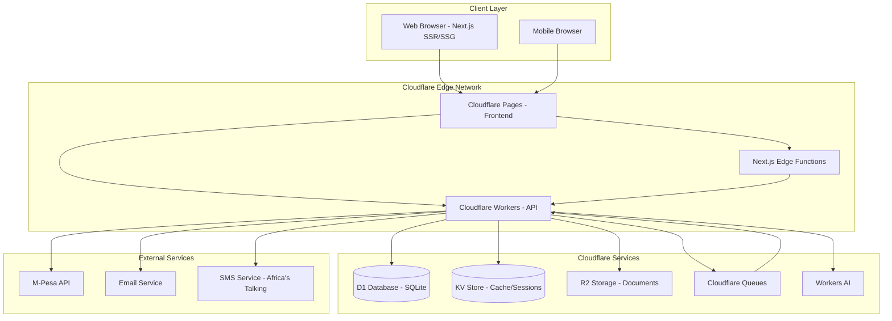
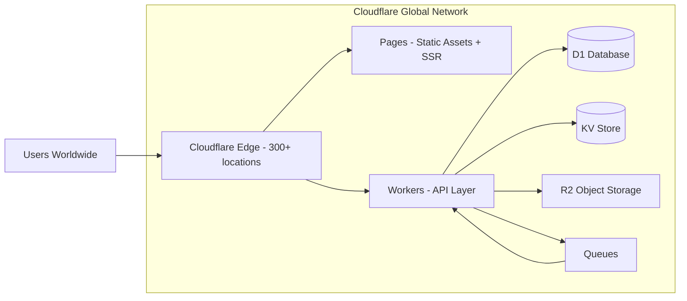
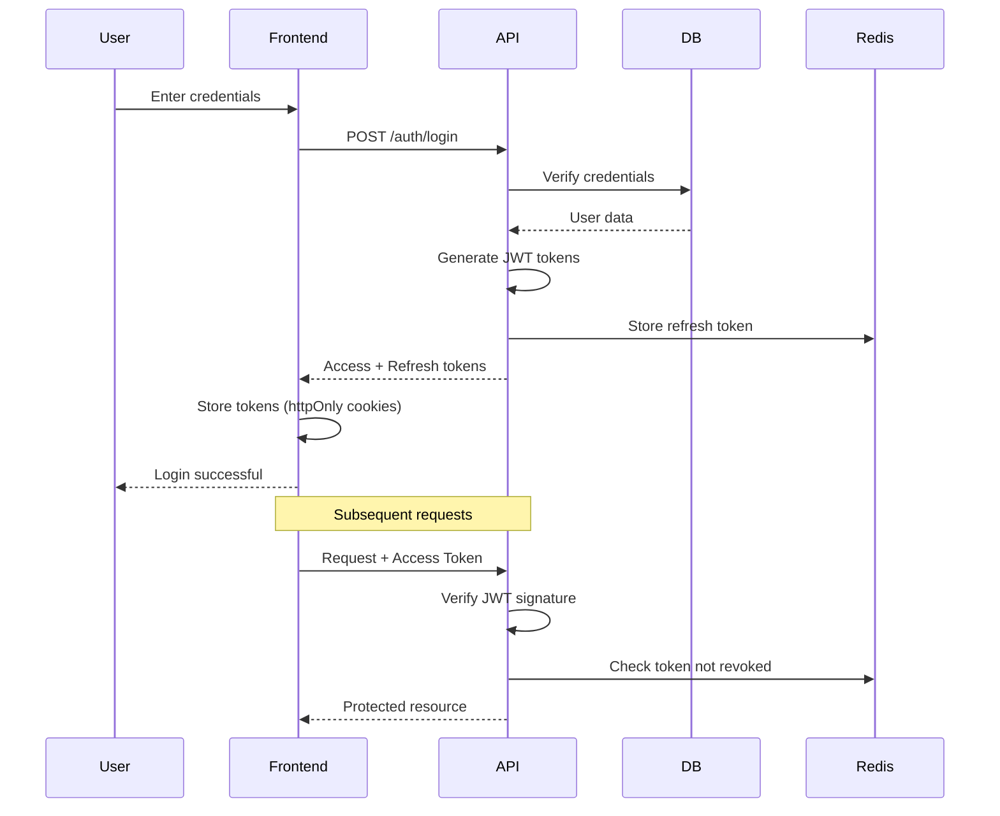
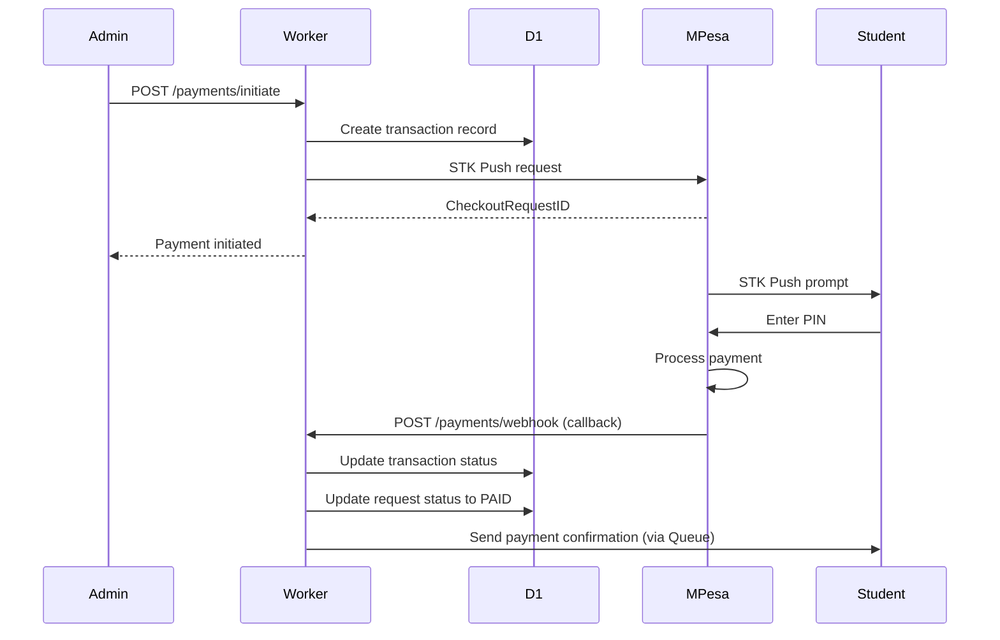

# Design Document: Financial Transparency and Accountability System

## Overview

The Financial Transparency and Accountability System is a secure, mobile-first web application designed for Bethel Rays of Hope NGO to manage financial requests from beneficiaries through a complete lifecycle: submission, review, approval, verification, payment, and archival. The system emphasizes transparency, auditability, and accessibility in low-bandwidth environments.

### Core Design Principles

1. **Security First**: All sensitive data encrypted at rest and in transit, with role-based access control
2. **Immutable Audit Trail**: Every action logged permanently for accountability
3. **Mobile-First**: Optimized for low-bandwidth environments and mobile devices
4. **Transparency**: Public dashboard for donor confidence without compromising beneficiary privacy
5. **Simplicity**: Clear workflows with minimal complexity for non-technical users

### System Boundaries

**In Scope:**
- User authentication and authorization
- Financial request submission and workflow management
- Document storage and version control
- Payment gateway integration (M-Pesa API)
- Audit logging and compliance reporting
- Public transparency dashboard
- AI-assisted reporting and anomaly detection
- Email and SMS notifications

**Out of Scope:**
- Donor management and fundraising campaigns
- Inventory management for supplies
- Direct beneficiary enrollment and case management
- Financial accounting and bookkeeping
- Third-party donor portal integration

## Architecture

### High-Level Architecture

The system follows a modern edge-first architecture leveraging Cloudflare's global network:



### Technology Stack

**Frontend:**
- **Framework**: Next.js 14+ (App Router) with TypeScript
- **Rendering**: Server-side rendering (SSR) and static generation (SSG) where appropriate
- **State Management**: React Context API + TanStack Query (React Query) for server state
- **UI Library**: Material-UI (MUI) v5 with custom theme
- **Form Management**: React Hook Form with Zod validation
- **HTTP Client**: Native fetch API with Next.js server actions and API routes
- **Hosting**: Cloudflare Pages with edge functions

**Backend:**
- **Runtime**: Cloudflare Workers (V8 isolates, serverless edge compute)
- **Framework**: Hono (lightweight web framework optimized for Cloudflare Workers)
- **Authentication**: JWT with refresh tokens, bcrypt for password hashing
- **Validation**: Zod for request validation
- **ORM**: Drizzle ORM for type-safe database access (optimized for edge)
- **API Documentation**: OpenAPI/Swagger

**Database:**
- **Primary Database**: Cloudflare D1 (SQLite at the edge) for transactional data
- **Alternative**: PostgreSQL on Neon or Supabase (if D1 limitations are encountered)
- **Cache**: Cloudflare KV (key-value store for session storage, rate limiting, temporary data)
- **Durable Objects**: For real-time features and coordination if needed

**Storage:**
- **Document Storage**: Cloudflare R2 (S3-compatible object storage)
- **CDN**: Cloudflare CDN (global edge network, automatic)

**External Services:**
- **Payment Gateway**: M-Pesa Daraja API
- **Email**: Cloudflare Email Routing + Workers for sending (or SendGrid as fallback)
- **SMS**: Africa's Talking API (better regional coverage for Kenya)
- **AI**: Cloudflare Workers AI (Llama 2, CodeLlama models) for report generation and anomaly detection

**Infrastructure:**
- **Hosting**: Cloudflare Pages (frontend) + Cloudflare Workers (backend APIs)
- **CI/CD**: GitHub Actions with Wrangler CLI for Cloudflare deployments
- **Monitoring**: Cloudflare Analytics + Cloudflare Logs + Sentry for error tracking
- **Queues**: Cloudflare Queues for background job processing (emails, reports)
- **Backup**: R2 versioning + D1 automated backups

### Deployment Architecture



**Key Benefits:**
- **Global Edge Deployment**: Serve content from 300+ locations worldwide
- **Zero Cold Starts**: V8 isolates start in <1ms
- **Automatic Scaling**: Handle traffic spikes without configuration
- **Built-in DDoS Protection**: Cloudflare's network-level security
- **Cost Efficiency**: Pay only for what you use, generous free tier

## Components and Interfaces

### Frontend Component Structure

```
app/ (Next.js App Router)
├── (auth)/
│   ├── login/
│   │   └── page.tsx
│   ├── register/
│   │   └── page.tsx
│   └── layout.tsx (Auth layout)
├── (dashboard)/
│   ├── student/
│   │   ├── page.tsx (Student dashboard)
│   │   └── requests/
│   │       ├── page.tsx (Request list)
│   │       ├── new/
│   │       │   └── page.tsx (Create request)
│   │       └── [id]/
│   │           └── page.tsx (Request detail)
│   ├── admin/
│   │   ├── page.tsx (Admin dashboard)
│   │   ├── requests/
│   │   │   ├── page.tsx (Review requests)
│   │   │   └── [id]/
│   │   │       └── page.tsx (Request review detail)
│   │   ├── users/
│   │   │   └── page.tsx (User management)
│   │   └── audit/
│   │       └── page.tsx (Audit log viewer)
│   ├── auditor/
│   │   ├── page.tsx (Auditor dashboard)
│   │   ├── verify/
│   │   │   └── page.tsx (Verification queue)
│   │   └── reports/
│   │       └── page.tsx (Reports & analytics)
│   └── layout.tsx (Dashboard layout with sidebar)
├── public-transparency/
│   └── page.tsx (Public dashboard - no auth)
├── api/ (Next.js API routes - optional, prefer Workers)
│   └── [...fallback]/
│       └── route.ts (Proxy to Cloudflare Workers if needed)
├── layout.tsx (Root layout)
├── page.tsx (Landing page)
└── globals.css

components/
├── auth/
│   ├── LoginForm.tsx
│   ├── RegisterForm.tsx
│   └── ProtectedRoute.tsx
├── requests/
│   ├── RequestForm.tsx
│   ├── RequestList.tsx
│   ├── RequestCard.tsx
│   ├── RequestDetail.tsx
│   ├── RequestStatusBadge.tsx
│   └── RequestTimeline.tsx
├── documents/
│   ├── DocumentUpload.tsx
│   ├── DocumentList.tsx
│   └── DocumentViewer.tsx
├── admin/
│   ├── DashboardStats.tsx
│   ├── UserManagement.tsx
│   ├── RequestReview.tsx
│   └── AuditLogViewer.tsx
├── transparency/
│   ├── PublicDashboard.tsx
│   ├── FundingChart.tsx
│   └── StatisticsCard.tsx
├── layout/
│   ├── Navbar.tsx
│   ├── Sidebar.tsx
│   ├── DashboardLayout.tsx
│   └── Footer.tsx
└── common/
    ├── LoadingSpinner.tsx
    ├── ErrorBoundary.tsx
    ├── NotificationToast.tsx
    └── DataTable.tsx

lib/
├── api/
│   ├── client.ts (API client configuration)
│   ├── auth.ts (Auth API calls)
│   ├── requests.ts (Request API calls)
│   ├── documents.ts (Document API calls)
│   └── users.ts (User API calls)
├── hooks/
│   ├── useAuth.ts
│   ├── useRequests.ts
│   ├── useDocuments.ts
│   └── useNotifications.ts
├── contexts/
│   ├── AuthContext.tsx
│   └── NotificationContext.tsx
├── utils/
│   ├── validation.ts
│   ├── formatting.ts
│   ├── constants.ts
│   └── errorHandling.ts
└── types/
    ├── user.ts
    ├── request.ts
    ├── document.ts
    └── api.ts

theme/
└── muiTheme.ts (Material-UI theme configuration)
```

### Backend Service Structure

```
workers/ (Cloudflare Workers)
├── api/
│   ├── index.ts (Main worker entry point)
│   ├── router.ts (Hono router configuration)
│   └── middleware/
│       ├── auth.ts
│       ├── cors.ts
│       ├── rateLimit.ts
│       ├── validation.ts
│       └── errorHandler.ts
├── handlers/
│   ├── auth.ts
│   ├── users.ts
│   ├── requests.ts
│   ├── documents.ts
│   ├── payments.ts
│   ├── audit.ts
│   ├── notifications.ts
│   ├── reports.ts
│   └── public.ts
├── services/
│   ├── authService.ts
│   ├── userService.ts
│   ├── requestService.ts
│   ├── documentService.ts
│   ├── paymentService.ts
│   ├── auditService.ts
│   ├── notificationService.ts
│   ├── aiService.ts
│   └── storageService.ts
├── db/
│   ├── schema.ts (Drizzle schema definitions)
│   ├── migrations/
│   └── client.ts (D1 client wrapper)
├── queues/
│   ├── emailQueue.ts
│   ├── smsQueue.ts
│   └── reportQueue.ts
├── utils/
│   ├── encryption.ts
│   ├── validation.ts
│   ├── logger.ts
│   └── constants.ts
├── types/
│   └── index.ts
└── wrangler.toml (Cloudflare Workers configuration)
```

### Key Interface Definitions

**User Roles:**
```typescript
enum UserRole {
  STUDENT = 'STUDENT',
  ADMIN_LEVEL_1 = 'ADMIN_LEVEL_1',
  ADMIN_LEVEL_2 = 'ADMIN_LEVEL_2'
}

interface User {
  id: string;
  email: string;
  phone: string;
  role: UserRole;
  firstName: string;
  lastName: string;
  isActive: boolean;
  isVerified: boolean;
  createdAt: Date;
  updatedAt: Date;
}
```

**Request Status Flow:**
```typescript
enum RequestStatus {
  SUBMITTED = 'SUBMITTED',
  UNDER_REVIEW = 'UNDER_REVIEW',
  PENDING_DOCUMENTS = 'PENDING_DOCUMENTS',
  APPROVED = 'APPROVED',
  VERIFIED = 'VERIFIED',
  PAID = 'PAID',
  REJECTED = 'REJECTED',
  FLAGGED = 'FLAGGED',
  ARCHIVED = 'ARCHIVED'
}

enum RequestType {
  SCHOOL_FEES = 'SCHOOL_FEES',
  MEDICAL_EXPENSES = 'MEDICAL_EXPENSES',
  SUPPLIES = 'SUPPLIES',
  EMERGENCY = 'EMERGENCY',
  OTHER = 'OTHER'
}

interface Request {
  id: string;
  studentId: string;
  type: RequestType;
  amount: number;
  reason: string;
  status: RequestStatus;
  submittedAt: Date;
  reviewedAt?: Date;
  verifiedAt?: Date;
  paidAt?: Date;
  rejectionReason?: string;
  flagReason?: string;
  documents: Document[];
  comments: Comment[];
  statusHistory: StatusChange[];
}
```

**Document Management:**
```typescript
interface Document {
  id: string;
  requestId: string;
  fileName: string;
  fileType: string;
  fileSize: number;
  s3Key: string;
  version: number;
  uploadedBy: string;
  uploadedAt: Date;
  isDeleted: boolean;
}
```

**Audit Log:**
```typescript
enum AuditAction {
  USER_LOGIN = 'USER_LOGIN',
  USER_LOGOUT = 'USER_LOGOUT',
  REQUEST_CREATED = 'REQUEST_CREATED',
  REQUEST_STATUS_CHANGED = 'REQUEST_STATUS_CHANGED',
  DOCUMENT_UPLOADED = 'DOCUMENT_UPLOADED',
  DOCUMENT_ACCESSED = 'DOCUMENT_ACCESSED',
  PAYMENT_INITIATED = 'PAYMENT_INITIATED',
  PAYMENT_COMPLETED = 'PAYMENT_COMPLETED',
  USER_CREATED = 'USER_CREATED',
  USER_DEACTIVATED = 'USER_DEACTIVATED'
}

interface AuditLog {
  id: string;
  userId: string;
  action: AuditAction;
  resourceType: string;
  resourceId: string;
  metadata: Record<string, any>;
  ipAddress: string;
  userAgent: string;
  timestamp: Date;
}
```

## Data Models

### Database Schema (Drizzle ORM for D1)

```typescript
// db/schema.ts

import { sqliteTable, text, integer, real } from 'drizzle-orm/sqlite-core';
import { sql } from 'drizzle-orm';

export const users = sqliteTable('users', {
  id: text('id').primaryKey(),
  email: text('email').notNull().unique(),
  phone: text('phone').notNull().unique(),
  passwordHash: text('password_hash').notNull(),
  role: text('role', { enum: ['STUDENT', 'ADMIN_LEVEL_1', 'ADMIN_LEVEL_2'] }).notNull(),
  firstName: text('first_name').notNull(),
  lastName: text('last_name').notNull(),
  accountStatus: text('account_status', { 
    enum: ['PENDING', 'ACTIVE', 'DEACTIVATED', 'REJECTED'] 
  }).default('PENDING').notNull(),
  isEmailVerified: integer('is_email_verified', { mode: 'boolean' }).default(false).notNull(),
  isPhoneVerified: integer('is_phone_verified', { mode: 'boolean' }).default(false).notNull(),
  createdAt: integer('created_at', { mode: 'timestamp' }).default(sql`CURRENT_TIMESTAMP`).notNull(),
  updatedAt: integer('updated_at', { mode: 'timestamp' }).default(sql`CURRENT_TIMESTAMP`).notNull(),
  lastLoginAt: integer('last_login_at', { mode: 'timestamp' }),
  approvedById: text('approved_by_id').references(() => users.id),
});

export const requests = sqliteTable('requests', {
  id: text('id').primaryKey(),
  studentId: text('student_id').notNull().references(() => users.id),
  type: text('type', { 
    enum: ['SCHOOL_FEES', 'MEDICAL_EXPENSES', 'SUPPLIES', 'EMERGENCY', 'OTHER'] 
  }).notNull(),
  amount: real('amount').notNull(),
  reason: text('reason').notNull(),
  status: text('status', {
    enum: ['SUBMITTED', 'UNDER_REVIEW', 'PENDING_DOCUMENTS', 'APPROVED', 
           'VERIFIED', 'PAID', 'REJECTED', 'FLAGGED', 'ARCHIVED']
  }).default('SUBMITTED').notNull(),
  submittedAt: integer('submitted_at', { mode: 'timestamp' }).default(sql`CURRENT_TIMESTAMP`).notNull(),
  reviewedAt: integer('reviewed_at', { mode: 'timestamp' }),
  verifiedAt: integer('verified_at', { mode: 'timestamp' }),
  paidAt: integer('paid_at', { mode: 'timestamp' }),
  archivedAt: integer('archived_at', { mode: 'timestamp' }),
  rejectionReason: text('rejection_reason'),
  flagReason: text('flag_reason'),
});

export const documents = sqliteTable('documents', {
  id: text('id').primaryKey(),
  requestId: text('request_id').notNull().references(() => requests.id),
  fileName: text('file_name').notNull(),
  fileType: text('file_type').notNull(),
  fileSize: integer('file_size').notNull(),
  r2Key: text('r2_key').notNull().unique(),
  r2Bucket: text('r2_bucket').notNull(),
  version: integer('version').default(1).notNull(),
  uploadedById: text('uploaded_by_id').notNull().references(() => users.id),
  uploadedAt: integer('uploaded_at', { mode: 'timestamp' }).default(sql`CURRENT_TIMESTAMP`).notNull(),
  isDeleted: integer('is_deleted', { mode: 'boolean' }).default(false).notNull(),
  scanStatus: text('scan_status').default('pending').notNull(),
});

export const documentAccess = sqliteTable('document_access', {
  id: text('id').primaryKey(),
  documentId: text('document_id').notNull().references(() => documents.id),
  userId: text('user_id').notNull(),
  accessedAt: integer('accessed_at', { mode: 'timestamp' }).default(sql`CURRENT_TIMESTAMP`).notNull(),
  ipAddress: text('ip_address').notNull(),
});

export const comments = sqliteTable('comments', {
  id: text('id').primaryKey(),
  requestId: text('request_id').notNull().references(() => requests.id),
  authorId: text('author_id').notNull().references(() => users.id),
  content: text('content').notNull(),
  createdAt: integer('created_at', { mode: 'timestamp' }).default(sql`CURRENT_TIMESTAMP`).notNull(),
  isInternal: integer('is_internal', { mode: 'boolean' }).default(false).notNull(),
});

export const statusChanges = sqliteTable('status_changes', {
  id: text('id').primaryKey(),
  requestId: text('request_id').notNull().references(() => requests.id),
  fromStatus: text('from_status'),
  toStatus: text('to_status').notNull(),
  changedById: text('changed_by_id').notNull(),
  changedAt: integer('changed_at', { mode: 'timestamp' }).default(sql`CURRENT_TIMESTAMP`).notNull(),
  reason: text('reason'),
});

export const transactions = sqliteTable('transactions', {
  id: text('id').primaryKey(),
  requestId: text('request_id').notNull().unique().references(() => requests.id),
  amount: real('amount').notNull(),
  currency: text('currency').default('KES').notNull(),
  mpesaTransactionId: text('mpesa_transaction_id').unique(),
  mpesaReceiptNumber: text('mpesa_receipt_number'),
  phoneNumber: text('phone_number').notNull(),
  status: text('status').notNull(),
  initiatedAt: integer('initiated_at', { mode: 'timestamp' }).default(sql`CURRENT_TIMESTAMP`).notNull(),
  completedAt: integer('completed_at', { mode: 'timestamp' }),
  failureReason: text('failure_reason'),
  metadata: text('metadata'), // JSON string
});

export const auditLogs = sqliteTable('audit_logs', {
  id: text('id').primaryKey(),
  userId: text('user_id').references(() => users.id),
  action: text('action', {
    enum: ['USER_LOGIN', 'USER_LOGIN_FAILED', 'USER_LOGOUT', 'USER_CREATED', 
           'USER_APPROVED', 'USER_DEACTIVATED', 'REQUEST_CREATED', 
           'REQUEST_STATUS_CHANGED', 'DOCUMENT_UPLOADED', 'DOCUMENT_ACCESSED',
           'PAYMENT_INITIATED', 'PAYMENT_COMPLETED', 'PAYMENT_FAILED', 
           'COMMENT_ADDED', 'REPORT_GENERATED']
  }).notNull(),
  resourceType: text('resource_type').notNull(),
  resourceId: text('resource_id'),
  metadata: text('metadata'), // JSON string
  ipAddress: text('ip_address').notNull(),
  userAgent: text('user_agent'),
  timestamp: integer('timestamp', { mode: 'timestamp' }).default(sql`CURRENT_TIMESTAMP`).notNull(),
});

export const notifications = sqliteTable('notifications', {
  id: text('id').primaryKey(),
  userId: text('user_id').notNull().references(() => users.id),
  type: text('type').notNull(),
  channel: text('channel').notNull(),
  subject: text('subject'),
  message: text('message').notNull(),
  status: text('status').default('pending').notNull(),
  sentAt: integer('sent_at', { mode: 'timestamp' }),
  failureReason: text('failure_reason'),
  retryCount: integer('retry_count').default(0).notNull(),
  metadata: text('metadata'), // JSON string
  createdAt: integer('created_at', { mode: 'timestamp' }).default(sql`CURRENT_TIMESTAMP`).notNull(),
});

export const publicStatistics = sqliteTable('public_statistics', {
  id: text('id').primaryKey(),
  date: text('date').notNull().unique(), // ISO date string
  totalReceived: real('total_received').notNull(),
  totalDisbursed: real('total_disbursed').notNull(),
  requestsApproved: integer('requests_approved').notNull(),
  requestsRejected: integer('requests_rejected').notNull(),
  requestsByType: text('requests_by_type').notNull(), // JSON string
  amountsByType: text('amounts_by_type').notNull(), // JSON string
  updatedAt: integer('updated_at', { mode: 'timestamp' }).default(sql`CURRENT_TIMESTAMP`).notNull(),
});
```

**Note on D1 Limitations:**
- D1 is SQLite-based, so some PostgreSQL features are not available
- No native ENUM types (using text with constraints)
- No DECIMAL type (using REAL for amounts, acceptable for this use case)
- JSON stored as TEXT (parse/stringify in application code)
- If D1 proves limiting, can migrate to PostgreSQL on Neon/Supabase with minimal schema changes

### Entity Relationship Diagram

```mermaid
erDiagram
    USER ||--o{ REQUEST : submits
    USER ||--o{ DOCUMENT : uploads
    USER ||--o{ COMMENT : writes
    USER ||--o{ AUDIT_LOG : generates
    USER ||--o{ NOTIFICATION : receives
    USER ||--o{ USER : approves
    
    REQUEST ||--o{ DOCUMENT : contains
    REQUEST ||--o{ COMMENT : has
    REQUEST ||--o{ STATUS_CHANGE : tracks
    REQUEST ||--|| TRANSACTION : processes
    
    DOCUMENT ||--o{ DOCUMENT_ACCESS : logs
    
    USER {
        uuid id PK
        string email UK
        string phone UK
        string passwordHash
        enum role
        string firstName
        string lastName
        enum accountStatus
        boolean isEmailVerified
        boolean isPhoneVerified
        datetime createdAt
        datetime updatedAt
    }
    
    REQUEST {
        uuid id PK
        uuid studentId FK
        enum type
        decimal amount
        text reason
        enum status
        datetime submittedAt
        datetime reviewedAt
        datetime verifiedAt
        datetime paidAt
    }
    
    DOCUMENT {
        uuid id PK
        uuid requestId FK
        string fileName
        string fileType
        int fileSize
        string s3Key UK
        int version
        uuid uploadedById FK
        datetime uploadedAt
        string scanStatus
    }
    
    TRANSACTION {
        uuid id PK
        uuid requestId FK UK
        decimal amount
        string mpesaTransactionId UK
        string phoneNumber
        string status
        datetime initiatedAt
        datetime completedAt
    }
    
    AUDIT_LOG {
        uuid id PK
        uuid userId FK
        enum action
        string resourceType
        string resourceId
        json metadata
        string ipAddress
        datetime timestamp
    }
```


## API Endpoints

### Authentication Endpoints

```
POST   /api/v1/auth/register
POST   /api/v1/auth/login
POST   /api/v1/auth/logout
POST   /api/v1/auth/refresh-token
POST   /api/v1/auth/verify-email
POST   /api/v1/auth/verify-phone
POST   /api/v1/auth/forgot-password
POST   /api/v1/auth/reset-password
GET    /api/v1/auth/me
```

**Example: POST /api/v1/auth/register**
```typescript
// Request
{
  "email": "student@example.com",
  "phone": "+254712345678",
  "password": "SecurePass123!",
  "firstName": "John",
  "lastName": "Doe",
  "role": "STUDENT"
}

// Response (201 Created)
{
  "success": true,
  "message": "Registration successful. Awaiting admin approval.",
  "data": {
    "userId": "uuid",
    "email": "student@example.com",
    "accountStatus": "PENDING"
  }
}
```

**Example: POST /api/v1/auth/login**
```typescript
// Request
{
  "email": "student@example.com",
  "password": "SecurePass123!"
}

// Response (200 OK)
{
  "success": true,
  "data": {
    "user": {
      "id": "uuid",
      "email": "student@example.com",
      "role": "STUDENT",
      "firstName": "John",
      "lastName": "Doe"
    },
    "accessToken": "jwt-token",
    "refreshToken": "refresh-token",
    "expiresIn": 3600
  }
}
```

### User Management Endpoints

```
GET    /api/v1/users                    # Admin only - list all users
GET    /api/v1/users/:id                # Get user details
POST   /api/v1/users                    # Admin only - create user
PATCH  /api/v1/users/:id                # Update user
DELETE /api/v1/users/:id                # Admin only - deactivate user
POST   /api/v1/users/:id/approve        # Admin only - approve pending user
POST   /api/v1/users/:id/reject         # Admin only - reject pending user
POST   /api/v1/users/:id/reactivate     # Admin only - reactivate user
GET    /api/v1/users/pending            # Admin only - list pending approvals
```

### Request Management Endpoints

```
GET    /api/v1/requests                 # List requests (filtered by role)
GET    /api/v1/requests/:id             # Get request details
POST   /api/v1/requests                 # Student - create request
PATCH  /api/v1/requests/:id             # Update request
DELETE /api/v1/requests/:id             # Soft delete (draft only)

# Status transitions
POST   /api/v1/requests/:id/review      # Admin L1 - start review
POST   /api/v1/requests/:id/approve     # Admin L1 - approve request
POST   /api/v1/requests/:id/reject      # Admin L1/L2 - reject request
POST   /api/v1/requests/:id/verify      # Admin L2 - verify request
POST   /api/v1/requests/:id/flag        # Admin L2 - flag request
POST   /api/v1/requests/:id/request-docs # Admin L1 - request additional docs

# Comments
GET    /api/v1/requests/:id/comments    # Get request comments
POST   /api/v1/requests/:id/comments    # Add comment

# History
GET    /api/v1/requests/:id/history     # Get status change history
```

**Example: POST /api/v1/requests**
```typescript
// Request (multipart/form-data)
{
  "type": "SCHOOL_FEES",
  "amount": 15000.00,
  "reason": "Tuition payment for Term 2, 2024",
  "documents": [File, File] // Multipart files
}

// Response (201 Created)
{
  "success": true,
  "message": "Request submitted successfully",
  "data": {
    "id": "uuid",
    "type": "SCHOOL_FEES",
    "amount": 15000.00,
    "status": "SUBMITTED",
    "submittedAt": "2024-01-15T10:30:00Z",
    "documents": [
      {
        "id": "uuid",
        "fileName": "fee_structure.pdf",
        "fileSize": 245678
      }
    ]
  }
}
```

**Example: POST /api/v1/requests/:id/approve**
```typescript
// Request
{
  "comment": "Request approved. All documents verified."
}

// Response (200 OK)
{
  "success": true,
  "message": "Request approved successfully",
  "data": {
    "id": "uuid",
    "status": "APPROVED",
    "reviewedAt": "2024-01-16T14:20:00Z"
  }
}
```

### Document Management Endpoints

```
GET    /api/v1/documents/:id            # Get document metadata
GET    /api/v1/documents/:id/download   # Download document
POST   /api/v1/documents                # Upload document
GET    /api/v1/documents/:id/versions   # Get document version history
GET    /api/v1/requests/:id/documents   # Get all documents for request
```

**Example: GET /api/v1/documents/:id/download**
```typescript
// Response (200 OK)
// Returns pre-signed S3 URL or streams file
{
  "success": true,
  "data": {
    "downloadUrl": "https://s3.amazonaws.com/...",
    "expiresIn": 300 // seconds
  }
}
```

### Payment Endpoints

```
POST   /api/v1/payments/initiate        # Admin L1 - initiate payment
GET    /api/v1/payments/:id             # Get payment details
GET    /api/v1/payments/request/:requestId # Get payment for request
POST   /api/v1/payments/webhook         # M-Pesa callback webhook
GET    /api/v1/payments                 # List all payments (Admin only)
```

**Example: POST /api/v1/payments/initiate**
```typescript
// Request
{
  "requestId": "uuid",
  "phoneNumber": "+254712345678",
  "amount": 15000.00
}

// Response (200 OK)
{
  "success": true,
  "message": "Payment initiated successfully",
  "data": {
    "transactionId": "uuid",
    "mpesaCheckoutRequestId": "ws_CO_123456789",
    "status": "pending",
    "amount": 15000.00
  }
}
```

### Audit and Reporting Endpoints

```
GET    /api/v1/audit-logs               # Admin L2 - query audit logs
GET    /api/v1/audit-logs/:id           # Get specific audit log
GET    /api/v1/reports/monthly          # Admin L2 - generate monthly report
GET    /api/v1/reports/anomalies        # Admin L2 - get anomaly detection results
POST   /api/v1/reports/generate         # Admin L2 - generate custom report
GET    /api/v1/reports/:id/download     # Download generated report
```

**Example: GET /api/v1/audit-logs**
```typescript
// Request Query Parameters
?userId=uuid&action=REQUEST_STATUS_CHANGED&startDate=2024-01-01&endDate=2024-01-31&page=1&limit=50

// Response (200 OK)
{
  "success": true,
  "data": {
    "logs": [
      {
        "id": "uuid",
        "userId": "uuid",
        "action": "REQUEST_STATUS_CHANGED",
        "resourceType": "Request",
        "resourceId": "uuid",
        "metadata": {
          "fromStatus": "SUBMITTED",
          "toStatus": "APPROVED"
        },
        "timestamp": "2024-01-15T14:20:00Z"
      }
    ],
    "pagination": {
      "page": 1,
      "limit": 50,
      "total": 150,
      "totalPages": 3
    }
  }
}
```

**Example: GET /api/v1/reports/monthly**
```typescript
// Request Query Parameters
?month=2024-01

// Response (200 OK)
{
  "success": true,
  "data": {
    "period": "2024-01",
    "summary": {
      "totalRequests": 45,
      "approved": 38,
      "rejected": 5,
      "pending": 2,
      "totalDisbursed": 567000.00,
      "averageAmount": 14921.05
    },
    "byType": {
      "SCHOOL_FEES": { "count": 25, "amount": 375000.00 },
      "MEDICAL_EXPENSES": { "count": 10, "amount": 120000.00 },
      "SUPPLIES": { "count": 8, "amount": 60000.00 },
      "EMERGENCY": { "count": 2, "amount": 12000.00 }
    },
    "anomalies": [
      {
        "type": "REPEATED_REQUEST",
        "requestId": "uuid",
        "description": "Student submitted 3 requests within 30 days",
        "severity": "medium"
      }
    ],
    "aiSummary": "January 2024 showed a 15% increase in requests compared to December..."
  }
}
```

### Notification Endpoints

```
GET    /api/v1/notifications            # Get user notifications
GET    /api/v1/notifications/:id        # Get specific notification
PATCH  /api/v1/notifications/:id/read   # Mark notification as read
PATCH  /api/v1/notifications/read-all   # Mark all as read
GET    /api/v1/notifications/unread-count # Get unread count
```

### Public Transparency Endpoints

```
GET    /api/v1/public/statistics        # Get public statistics (no auth)
GET    /api/v1/public/statistics/monthly # Get monthly breakdown
GET    /api/v1/public/statistics/by-type # Get statistics by request type
GET    /api/v1/public/charts/funding    # Get funding chart data
```

**Example: GET /api/v1/public/statistics**
```typescript
// Response (200 OK)
{
  "success": true,
  "data": {
    "totalReceived": 5000000.00,
    "totalDisbursed": 4750000.00,
    "currentMonth": {
      "requestsApproved": 38,
      "requestsRejected": 5,
      "amountDisbursed": 567000.00
    },
    "byType": {
      "SCHOOL_FEES": {
        "count": 150,
        "totalAmount": 2250000.00,
        "percentage": 47.4
      },
      "MEDICAL_EXPENSES": {
        "count": 80,
        "totalAmount": 1200000.00,
        "percentage": 25.3
      },
      "SUPPLIES": {
        "count": 60,
        "totalAmount": 900000.00,
        "percentage": 18.9
      },
      "EMERGENCY": {
        "count": 20,
        "totalAmount": 400000.00,
        "percentage": 8.4
      }
    },
    "lastUpdated": "2024-01-31T23:59:59Z"
  }
}
```

### API Response Format Standards

All API responses follow a consistent format:

**Success Response:**
```typescript
{
  "success": true,
  "data": { /* response data */ },
  "message": "Optional success message"
}
```

**Error Response:**
```typescript
{
  "success": false,
  "error": {
    "code": "ERROR_CODE",
    "message": "Human-readable error message",
    "details": { /* optional additional details */ }
  }
}
```

**Pagination Format:**
```typescript
{
  "success": true,
  "data": {
    "items": [ /* array of items */ ],
    "pagination": {
      "page": 1,
      "limit": 50,
      "total": 150,
      "totalPages": 3,
      "hasNext": true,
      "hasPrev": false
    }
  }
}
```

### API Security

**Authentication:**
- All protected endpoints require JWT Bearer token in Authorization header
- Format: `Authorization: Bearer <access_token>`
- Access tokens expire after 1 hour
- Refresh tokens expire after 7 days

**Rate Limiting:**
- Public endpoints: 100 requests per 15 minutes per IP
- Authenticated endpoints: 1000 requests per 15 minutes per user
- File upload endpoints: 10 requests per 15 minutes per user

**Request Validation:**
- All request bodies validated using Zod schemas
- File uploads validated for type, size, and malicious content
- SQL injection prevention via Prisma ORM
- XSS prevention via input sanitization


## Security Architecture

### Authentication and Authorization

**Authentication Flow:**



**Authorization Strategy:**

Role-based access control (RBAC) with middleware enforcement:

```typescript
// Authorization matrix
const permissions = {
  STUDENT: [
    'request:create',
    'request:read:own',
    'request:update:own:draft',
    'document:upload:own',
    'document:read:own',
    'notification:read:own'
  ],
  ADMIN_LEVEL_1: [
    'request:read:all',
    'request:review',
    'request:approve',
    'request:reject',
    'request:request-docs',
    'document:read:all',
    'user:create',
    'user:approve',
    'user:deactivate',
    'payment:initiate',
    'comment:create'
  ],
  ADMIN_LEVEL_2: [
    'request:read:all',
    'request:verify',
    'request:flag',
    'request:reject',
    'document:read:all',
    'audit:read',
    'report:generate',
    'user:read:all',
    'comment:create:internal'
  ]
};
```

**Token Management:**
- Access tokens: JWT, 1-hour expiration, contains user ID and role
- Refresh tokens: Random UUID, 7-day expiration, stored in Redis
- Token rotation: New refresh token issued on each refresh
- Token revocation: Blacklist in Redis for immediate logout

### Data Encryption

**Encryption at Rest:**
- Database: PostgreSQL with Transparent Data Encryption (TDE)
- Documents: S3 server-side encryption (SSE-S3 or SSE-KMS)
- Backups: Encrypted using AWS KMS
- Sensitive fields: Additional application-level encryption for PII

**Encryption in Transit:**
- TLS 1.3 for all API communications
- HTTPS enforced with HSTS headers
- Certificate pinning for mobile apps (future)

**Encryption Implementation:**

```typescript
// Application-level encryption for sensitive fields
import crypto from 'crypto';

const ENCRYPTION_KEY = process.env.ENCRYPTION_KEY; // 32-byte key
const ALGORITHM = 'aes-256-gcm';

export function encrypt(text: string): string {
  const iv = crypto.randomBytes(16);
  const cipher = crypto.createCipheriv(ALGORITHM, ENCRYPTION_KEY, iv);
  
  let encrypted = cipher.update(text, 'utf8', 'hex');
  encrypted += cipher.final('hex');
  
  const authTag = cipher.getAuthTag();
  
  return `${iv.toString('hex')}:${authTag.toString('hex')}:${encrypted}`;
}

export function decrypt(encryptedText: string): string {
  const [ivHex, authTagHex, encrypted] = encryptedText.split(':');
  
  const iv = Buffer.from(ivHex, 'hex');
  const authTag = Buffer.from(authTagHex, 'hex');
  const decipher = crypto.createDecipheriv(ALGORITHM, ENCRYPTION_KEY, iv);
  
  decipher.setAuthTag(authTag);
  
  let decrypted = decipher.update(encrypted, 'hex', 'utf8');
  decrypted += decipher.final('utf8');
  
  return decrypted;
}
```

### Document Security

**Upload Security:**
1. File type validation (whitelist: PDF, JPG, PNG, JPEG)
2. File size validation (max 10MB)
3. Malware scanning using ClamAV or AWS GuardDuty
4. Content-Type verification
5. Filename sanitization

**Storage Security:**
- S3 bucket: Private, no public access
- Pre-signed URLs: 5-minute expiration for downloads
- Access logging: All document access logged to audit trail
- Versioning: Enabled to prevent accidental deletion

**Document Access Control:**

```typescript
// Document access verification
async function canAccessDocument(userId: string, documentId: string): Promise<boolean> {
  const document = await prisma.document.findUnique({
    where: { id: documentId },
    include: { request: true }
  });
  
  if (!document) return false;
  
  const user = await prisma.user.findUnique({ where: { id: userId } });
  
  // Students can only access their own documents
  if (user.role === 'STUDENT') {
    return document.request.studentId === userId;
  }
  
  // Admins can access all documents
  if (user.role === 'ADMIN_LEVEL_1' || user.role === 'ADMIN_LEVEL_2') {
    return true;
  }
  
  return false;
}
```

### Audit Logging

**Audit Strategy:**
- Log all authentication attempts (success and failure)
- Log all data modifications (create, update, delete)
- Log all document access
- Log all payment transactions
- Log all administrative actions

**Audit Log Implementation:**

```typescript
// Audit middleware
export async function auditLog(
  userId: string | null,
  action: AuditAction,
  resourceType: string,
  resourceId: string | null,
  metadata: Record<string, any>,
  req: Request
) {
  await prisma.auditLog.create({
    data: {
      userId,
      action,
      resourceType,
      resourceId,
      metadata,
      ipAddress: req.ip,
      userAgent: req.headers['user-agent'] || 'unknown',
      timestamp: new Date()
    }
  });
}

// Usage in controller
async function approveRequest(req: Request, res: Response) {
  const { id } = req.params;
  const userId = req.user.id;
  
  const request = await requestService.approve(id, userId);
  
  await auditLog(
    userId,
    AuditAction.REQUEST_STATUS_CHANGED,
    'Request',
    id,
    { fromStatus: 'SUBMITTED', toStatus: 'APPROVED' },
    req
  );
  
  res.json({ success: true, data: request });
}
```

### Input Validation and Sanitization

**Validation Strategy:**
- All inputs validated using Zod schemas
- SQL injection prevention via Prisma ORM (parameterized queries)
- XSS prevention via input sanitization and Content Security Policy
- CSRF protection using tokens for state-changing operations

**Example Validation Schema:**

```typescript
import { z } from 'zod';

export const createRequestSchema = z.object({
  type: z.enum(['SCHOOL_FEES', 'MEDICAL_EXPENSES', 'SUPPLIES', 'EMERGENCY', 'OTHER']),
  amount: z.number().positive().max(1000000).multipleOf(0.01),
  reason: z.string().min(10).max(1000).trim(),
  documents: z.array(z.any()).min(1).max(5)
});

export const loginSchema = z.object({
  email: z.string().email().toLowerCase().trim(),
  password: z.string().min(8).max(100)
});

// Sanitization
import DOMPurify from 'isomorphic-dompurify';

export function sanitizeHtml(input: string): string {
  return DOMPurify.sanitize(input, { ALLOWED_TAGS: [] });
}
```

### Security Headers

```typescript
// Helmet configuration for Express
import helmet from 'helmet';

app.use(helmet({
  contentSecurityPolicy: {
    directives: {
      defaultSrc: ["'self'"],
      styleSrc: ["'self'", "'unsafe-inline'"],
      scriptSrc: ["'self'"],
      imgSrc: ["'self'", "data:", "https:"],
      connectSrc: ["'self'", "https://api.openai.com"],
      fontSrc: ["'self'"],
      objectSrc: ["'none'"],
      mediaSrc: ["'self'"],
      frameSrc: ["'none'"]
    }
  },
  hsts: {
    maxAge: 31536000,
    includeSubDomains: true,
    preload: true
  },
  noSniff: true,
  xssFilter: true,
  referrerPolicy: { policy: 'strict-origin-when-cross-origin' }
}));
```

## Integration Points

### M-Pesa Payment Integration

**M-Pesa Daraja API Integration with Cloudflare Workers:**

```typescript
// services/paymentService.ts (Cloudflare Worker)

interface MpesaConfig {
  consumerKey: string;
  consumerSecret: string;
  shortcode: string;
  passkey: string;
  callbackUrl: string;
}

class MpesaService {
  private config: MpesaConfig;
  private baseUrl = 'https://api.safaricom.co.ke';
  
  constructor(env: Env) {
    this.config = {
      consumerKey: env.MPESA_CONSUMER_KEY,
      consumerSecret: env.MPESA_CONSUMER_SECRET,
      shortcode: env.MPESA_SHORTCODE,
      passkey: env.MPESA_PASSKEY,
      callbackUrl: env.MPESA_CALLBACK_URL
    };
  }
  
  async getAccessToken(): Promise<string> {
    const auth = btoa(`${this.config.consumerKey}:${this.config.consumerSecret}`);
    
    const response = await fetch(
      `${this.baseUrl}/oauth/v1/generate?grant_type=client_credentials`,
      { 
        headers: { 
          'Authorization': `Basic ${auth}`,
          'Content-Type': 'application/json'
        } 
      }
    );
    
    const data = await response.json();
    return data.access_token;
  }
  
  async initiateSTKPush(
    phoneNumber: string,
    amount: number,
    accountReference: string,
    transactionDesc: string
  ): Promise<any> {
    const token = await this.getAccessToken();
    const timestamp = new Date().toISOString().replace(/[^0-9]/g, '').slice(0, 14);
    const password = btoa(`${this.config.shortcode}${this.config.passkey}${timestamp}`);
    
    const response = await fetch(
      `${this.baseUrl}/mpesa/stkpush/v1/processrequest`,
      {
        method: 'POST',
        headers: {
          'Authorization': `Bearer ${token}`,
          'Content-Type': 'application/json'
        },
        body: JSON.stringify({
          BusinessShortCode: this.config.shortcode,
          Password: password,
          Timestamp: timestamp,
          TransactionType: 'CustomerPayBillOnline',
          Amount: amount,
          PartyA: phoneNumber,
          PartyB: this.config.shortcode,
          PhoneNumber: phoneNumber,
          CallBackURL: this.config.callbackUrl,
          AccountReference: accountReference,
          TransactionDesc: transactionDesc
        })
      }
    );
    
    return await response.json();
  }
  
  async handleCallback(callbackData: any, db: D1Database): Promise<void> {
    const { Body } = callbackData;
    const { stkCallback } = Body;
    
    const transactionId = stkCallback.CheckoutRequestID;
    const resultCode = stkCallback.ResultCode;
    
    if (resultCode === 0) {
      // Payment successful
      const metadata = stkCallback.CallbackMetadata.Item;
      const mpesaReceiptNumber = metadata.find(
        (item: any) => item.Name === 'MpesaReceiptNumber'
      )?.Value;
      
      // Update transaction in D1
      await db.prepare(`
        UPDATE transactions 
        SET status = 'completed',
            mpesa_receipt_number = ?,
            completed_at = CURRENT_TIMESTAMP,
            metadata = ?
        WHERE mpesa_transaction_id = ?
      `).bind(mpesaReceiptNumber, JSON.stringify(callbackData), transactionId).run();
      
      // Get request ID and update request status
      const transaction = await db.prepare(`
        SELECT request_id FROM transactions WHERE mpesa_transaction_id = ?
      `).bind(transactionId).first();
      
      if (transaction) {
        await db.prepare(`
          UPDATE requests 
          SET status = 'PAID', paid_at = CURRENT_TIMESTAMP 
          WHERE id = ?
        `).bind(transaction.request_id).run();
        
        // Queue notification to student
        // (handled by Cloudflare Queue)
      }
    } else {
      // Payment failed
      await db.prepare(`
        UPDATE transactions 
        SET status = 'failed', failure_reason = ?
        WHERE mpesa_transaction_id = ?
      `).bind(stkCallback.ResultDesc, transactionId).run();
    }
  }
}
```

**Payment Flow:**



### Email Notification Integration

**Email Service using Cloudflare Workers + Email Routing:**

```typescript
// services/notificationService.ts (Cloudflare Worker)

interface EmailMessage {
  to: string;
  from: string;
  subject: string;
  text: string;
  html: string;
}

class EmailService {
  private env: Env;
  
  constructor(env: Env) {
    this.env = env;
  }
  
  async sendRequestSubmittedEmail(userId: string, requestId: string, db: D1Database) {
    const user = await db.prepare('SELECT * FROM users WHERE id = ?').bind(userId).first();
    const request = await db.prepare('SELECT * FROM requests WHERE id = ?').bind(requestId).first();
    
    const message: EmailMessage = {
      to: user.email,
      from: 'noreply@bethelraysofhope.org',
      subject: 'Request Submitted Successfully',
      text: `Your request for ${request.type} has been submitted and is under review.`,
      html: `
        <h2>Request Submitted</h2>
        <p>Dear ${user.first_name},</p>
        <p>Your request for <strong>${request.type}</strong> of amount <strong>KES ${request.amount}</strong> has been submitted successfully.</p>
        <p>Request ID: ${request.id}</p>
        <p>Status: ${request.status}</p>
        <p>You will receive updates as your request is processed.</p>
        <br>
        <p>Best regards,<br>Bethel Rays of Hope</p>
      `
    };
    
    // Queue email for sending
    await this.env.EMAIL_QUEUE.send({
      type: 'email',
      userId,
      message
    });
    
    // Log notification
    await db.prepare(`
      INSERT INTO notifications (id, user_id, type, channel, subject, message, status, created_at)
      VALUES (?, ?, 'email', ?, ?, ?, 'pending', CURRENT_TIMESTAMP)
    `).bind(
      crypto.randomUUID(),
      userId,
      user.email,
      message.subject,
      message.text
    ).run();
  }
  
  async sendRequestApprovedEmail(requestId: string, db: D1Database) {
    const request = await db.prepare(`
      SELECT r.*, u.email, u.first_name 
      FROM requests r 
      JOIN users u ON r.student_id = u.id 
      WHERE r.id = ?
    `).bind(requestId).first();
    
    const message: EmailMessage = {
      to: request.email,
      from: 'noreply@bethelraysofhope.org',
      subject: 'Request Approved',
      text: `Great news! Your request for ${request.type} has been approved.`,
      html: `
        <h2>Request Approved</h2>
        <p>Dear ${request.first_name},</p>
        <p>Great news! Your request for <strong>${request.type}</strong> has been approved.</p>
        <p>Amount: <strong>KES ${request.amount}</strong></p>
        <p>The request is now being verified and payment will be processed soon.</p>
        <br>
        <p>Best regards,<br>Bethel Rays of Hope</p>
      `
    };
    
    await this.env.EMAIL_QUEUE.send({
      type: 'email',
      userId: request.student_id,
      message
    });
  }
}

// Queue consumer for email sending
export default {
  async queue(batch: MessageBatch<any>, env: Env): Promise<void> {
    for (const message of batch.messages) {
      const { type, userId, message: emailMessage } = message.body;
      
      if (type === 'email') {
        try {
          // Option 1: Use Cloudflare Email Workers (if configured)
          // await sendEmailViaWorker(emailMessage);
          
          // Option 2: Use external service like SendGrid as fallback
          await fetch('https://api.sendgrid.com/v3/mail/send', {
            method: 'POST',
            headers: {
              'Authorization': `Bearer ${env.SENDGRID_API_KEY}`,
              'Content-Type': 'application/json'
            },
            body: JSON.stringify({
              personalizations: [{ to: [{ email: emailMessage.to }] }],
              from: { email: emailMessage.from },
              subject: emailMessage.subject,
              content: [
                { type: 'text/plain', value: emailMessage.text },
                { type: 'text/html', value: emailMessage.html }
              ]
            })
          });
          
          // Update notification status
          const db = env.DB;
          await db.prepare(`
            UPDATE notifications 
            SET status = 'sent', sent_at = CURRENT_TIMESTAMP 
            WHERE user_id = ? AND message = ? AND status = 'pending'
          `).bind(userId, emailMessage.text).run();
          
          message.ack();
        } catch (error) {
          // Update notification with failure
          const db = env.DB;
          await db.prepare(`
            UPDATE notifications 
            SET status = 'failed', 
                failure_reason = ?,
                retry_count = retry_count + 1
            WHERE user_id = ? AND message = ? AND status = 'pending'
          `).bind(error.message, userId, emailMessage.text).run();
          
          // Retry if under limit
          if (message.body.retryCount < 3) {
            message.retry();
          } else {
            message.ack();
          }
        }
      }
    }
  }
};
```

### SMS Notification Integration (Africa's Talking)

```typescript
// services/smsService.ts (Cloudflare Worker)

class SMSService {
  private env: Env;
  
  constructor(env: Env) {
    this.env = env;
  }
  
  async sendRequestStatusSMS(userId: string, status: string, requestId: string, db: D1Database) {
    const user = await db.prepare('SELECT * FROM users WHERE id = ?').bind(userId).first();
    
    const message = `Bethel Rays of Hope: Your request ${requestId.slice(0, 8)} status is now ${status}. Check your account for details.`;
    
    try {
      // Africa's Talking API call
      const response = await fetch('https://api.africastalking.com/version1/messaging', {
        method: 'POST',
        headers: {
          'apiKey': this.env.AT_API_KEY,
          'Content-Type': 'application/x-www-form-urlencoded',
          'Accept': 'application/json'
        },
        body: new URLSearchParams({
          username: this.env.AT_USERNAME,
          to: user.phone,
          message: message,
          from: 'BETHEL'
        })
      });
      
      const result = await response.json();
      
      await db.prepare(`
        INSERT INTO notifications (id, user_id, type, channel, message, status, sent_at, metadata, created_at)
        VALUES (?, ?, 'sms', ?, ?, 'sent', CURRENT_TIMESTAMP, ?, CURRENT_TIMESTAMP)
      `).bind(
        crypto.randomUUID(),
        userId,
        user.phone,
        message,
        JSON.stringify(result)
      ).run();
    } catch (error) {
      await db.prepare(`
        INSERT INTO notifications (id, user_id, type, channel, message, status, failure_reason, created_at)
        VALUES (?, ?, 'sms', ?, ?, 'failed', ?, CURRENT_TIMESTAMP)
      `).bind(
        crypto.randomUUID(),
        userId,
        user.phone,
        message,
        error.message
      ).run();
    }
  }
  
  async sendPaymentConfirmationSMS(requestId: string, mpesaReceipt: string, db: D1Database) {
    const request = await db.prepare(`
      SELECT r.*, u.phone, t.amount 
      FROM requests r 
      JOIN users u ON r.student_id = u.id 
      JOIN transactions t ON r.id = t.request_id
      WHERE r.id = ?
    `).bind(requestId).first();
    
    const message = `Payment confirmed! KES ${request.amount} sent. M-Pesa receipt: ${mpesaReceipt}. Thank you.`;
    
    await fetch('https://api.africastalking.com/version1/messaging', {
      method: 'POST',
      headers: {
        'apiKey': this.env.AT_API_KEY,
        'Content-Type': 'application/x-www-form-urlencoded',
        'Accept': 'application/json'
      },
      body: new URLSearchParams({
        username: this.env.AT_USERNAME,
        to: request.phone,
        message: message,
        from: 'BETHEL'
      })
    });
  }
}
```

### AI Reporting Integration (Cloudflare Workers AI)

```typescript
// services/aiService.ts (Cloudflare Worker)

class AIService {
  private env: Env;
  
  constructor(env: Env) {
    this.env = env;
  }
  
  async generateMonthlySummary(month: string, db: D1Database): Promise<string> {
    const stats = await this.getMonthlyStatistics(month, db);
    
    const prompt = `
      Generate a concise monthly financial summary for an NGO based on the following data:
      
      Total Requests: ${stats.totalRequests}
      Approved: ${stats.approved}
      Rejected: ${stats.rejected}
      Total Disbursed: KES ${stats.totalDisbursed}
      
      Breakdown by type:
      ${JSON.stringify(stats.byType, null, 2)}
      
      Previous month comparison:
      ${JSON.stringify(stats.previousMonth, null, 2)}
      
      Generate a 2-3 paragraph summary highlighting key trends, notable changes, and insights.
    `;
    
    // Use Cloudflare Workers AI
    const response = await this.env.AI.run('@cf/meta/llama-2-7b-chat-int8', {
      messages: [
        {
          role: 'system',
          content: 'You are a financial analyst for an NGO. Provide clear, professional summaries.'
        },
        { role: 'user', content: prompt }
      ],
      max_tokens: 500,
      temperature: 0.7
    });
    
    return response.response;
  }
  
  async detectAnomalies(requestId: string, db: D1Database): Promise<any[]> {
    const request = await db.prepare(`
      SELECT * FROM requests WHERE id = ?
    `).bind(requestId).first();
    
    const anomalies = [];
    
    // Check for repeated requests
    const recentRequests = await db.prepare(`
      SELECT COUNT(*) as count 
      FROM requests 
      WHERE student_id = ? 
        AND submitted_at >= datetime('now', '-30 days')
    `).bind(request.student_id).first();
    
    if (recentRequests.count > 3) {
      anomalies.push({
        type: 'REPEATED_REQUEST',
        severity: 'medium',
        description: `Student has submitted ${recentRequests.count} requests in the last 30 days`
      });
    }
    
    // Check for amount outliers
    const avgStats = await db.prepare(`
      SELECT 
        AVG(amount) as avg_amount,
        (AVG(amount * amount) - AVG(amount) * AVG(amount)) as variance
      FROM requests 
      WHERE type = ?
    `).bind(request.type).first();
    
    const stdDev = Math.sqrt(avgStats.variance);
    const zScore = (request.amount - avgStats.avg_amount) / stdDev;
    
    if (Math.abs(zScore) > 3) {
      anomalies.push({
        type: 'AMOUNT_OUTLIER',
        severity: 'high',
        description: `Request amount is ${zScore.toFixed(2)} standard deviations from the mean`
      });
    }
    
    return anomalies;
  }
  
  private async getMonthlyStatistics(month: string, db: D1Database) {
    // Implementation to fetch monthly statistics from D1
    const stats = await db.prepare(`
      SELECT 
        COUNT(*) as total_requests,
        SUM(CASE WHEN status = 'APPROVED' THEN 1 ELSE 0 END) as approved,
        SUM(CASE WHEN status = 'REJECTED' THEN 1 ELSE 0 END) as rejected,
        SUM(CASE WHEN status = 'PAID' THEN amount ELSE 0 END) as total_disbursed
      FROM requests
      WHERE strftime('%Y-%m', submitted_at) = ?
    `).bind(month).first();
    
    return {
      totalRequests: stats.total_requests,
      approved: stats.approved,
      rejected: stats.rejected,
      totalDisbursed: stats.total_disbursed,
      byType: {}, // Additional query for breakdown
      previousMonth: {} // Additional query for comparison
    };
  }
}
```

**Note on Cloudflare Workers AI:**
- Uses open-source models (Llama 2, CodeLlama) running on Cloudflare's network
- Lower cost than OpenAI API
- Data stays within Cloudflare infrastructure
- Fallback to OpenAI API if more advanced capabilities needed
- Models available: `@cf/meta/llama-2-7b-chat-int8`, `@cf/meta/llama-2-13b-chat-int8`


## Performance Optimization for Low-Bandwidth Environments

### Frontend Optimization Strategies

**1. Next.js Server-Side Rendering and Static Generation**

```typescript
// app/student/page.tsx - Server Component with data fetching
import { Suspense } from 'react';

async function getStudentData(userId: string) {
  // Fetch from Cloudflare Workers API
  const res = await fetch(`${process.env.API_URL}/users/${userId}`, {
    next: { revalidate: 60 } // Cache for 60 seconds
  });
  return res.json();
}

export default async function StudentDashboard() {
  const data = await getStudentData('user-id');
  
  return (
    <div>
      <h1>Welcome, {data.firstName}</h1>
      <Suspense fallback={<LoadingSkeleton />}>
        <RequestList />
      </Suspense>
    </div>
  );
}

// app/public-transparency/page.tsx - Static Generation
export const revalidate = 3600; // Revalidate every hour

async function getPublicStats() {
  const res = await fetch(`${process.env.API_URL}/public/statistics`);
  return res.json();
}

export default async function PublicDashboard() {
  const stats = await getPublicStats();
  
  return (
    <div>
      <h1>Financial Transparency</h1>
      <StatisticsDisplay data={stats} />
    </div>
  );
}
```

**2. Code Splitting and Dynamic Imports**

```typescript
// Dynamic imports for heavy components
import dynamic from 'next/dynamic';

const RequestForm = dynamic(() => import('@/components/requests/RequestForm'), {
  loading: () => <LoadingSpinner />,
  ssr: false // Client-side only for form interactions
});

const ChartComponent = dynamic(() => import('@/components/transparency/FundingChart'), {
  loading: () => <div>Loading chart...</div>,
  ssr: false
});
```

**3. Image Optimization with Next.js Image Component**

```typescript
import Image from 'next/image';

// Automatic optimization, lazy loading, and responsive images
<Image
  src="/logo.png"
  alt="Bethel Rays of Hope"
  width={200}
  height={100}
  priority={false} // Lazy load by default
  quality={75} // Optimize for low bandwidth
/>
```

**4. Cloudflare Pages Caching**

```typescript
// next.config.ts
const nextConfig = {
  images: {
    domains: ['pub-xxxxx.r2.dev'], // Cloudflare R2 domain
    formats: ['image/avif', 'image/webp'],
  },
  // Cloudflare Pages automatically handles caching
  // Static assets cached at edge locations
  headers: async () => [
    {
      source: '/:path*',
      headers: [
        {
          key: 'Cache-Control',
          value: 'public, max-age=31536000, immutable',
        },
      ],
    },
  ],
};
```

**5. Progressive Web App (PWA) with Next.js**

```typescript
// next.config.ts with PWA plugin
import withPWA from 'next-pwa';

const config = withPWA({
  dest: 'public',
  register: true,
  skipWaiting: true,
  disable: process.env.NODE_ENV === 'development',
  runtimeCaching: [
    {
      urlPattern: /^https:\/\/api\./,
      handler: 'NetworkFirst',
      options: {
        cacheName: 'api-cache',
        expiration: {
          maxEntries: 50,
          maxAgeSeconds: 300, // 5 minutes
        },
      },
    },
  ],
});

export default config;
```

**6. Data Fetching with TanStack Query**

```typescript
// lib/hooks/useRequests.ts
'use client';

import { useQuery } from '@tanstack/react-query';

export function useRequests() {
  return useQuery({
    queryKey: ['requests'],
    queryFn: async () => {
      const res = await fetch('/api/requests');
      return res.json();
    },
    staleTime: 60000, // Consider data fresh for 1 minute
    cacheTime: 300000, // Keep in cache for 5 minutes
  });
}

// Infinite scroll with pagination
export function useInfiniteRequests() {
  return useInfiniteQuery({
    queryKey: ['requests'],
    queryFn: ({ pageParam = 1 }) => 
      fetch(`/api/requests?page=${pageParam}&limit=20`).then(r => r.json()),
    getNextPageParam: (lastPage) => 
      lastPage.hasNext ? lastPage.page + 1 : undefined,
  });
}
```

### Backend Optimization Strategies

**1. Cloudflare Workers Edge Computing**

```typescript
// workers/api/index.ts
import { Hono } from 'hono';
import { cors } from 'hono/cors';
import { cache } from 'hono/cache';

const app = new Hono<{ Bindings: Env }>();

// CORS middleware
app.use('/*', cors());

// Cache middleware for public endpoints
app.use(
  '/api/v1/public/*',
  cache({
    cacheName: 'public-api',
    cacheControl: 'max-age=3600', // 1 hour
  })
);

// Routes execute at the edge, close to users
app.get('/api/v1/requests', async (c) => {
  const db = c.env.DB;
  
  // Query D1 database
  const requests = await db.prepare(`
    SELECT id, type, amount, status, submitted_at 
    FROM requests 
    WHERE student_id = ? 
    ORDER BY submitted_at DESC 
    LIMIT 20
  `).bind(c.get('userId')).all();
  
  return c.json({ success: true, data: requests.results });
});

export default app;
```

**2. Cloudflare KV for Caching**

```typescript
// services/cacheService.ts
class CacheService {
  private kv: KVNamespace;
  
  constructor(kv: KVNamespace) {
    this.kv = kv;
  }
  
  async get<T>(key: string): Promise<T | null> {
    const cached = await this.kv.get(key, 'json');
    return cached as T | null;
  }
  
  async set(key: string, value: any, ttl: number = 3600): Promise<void> {
    await this.kv.put(key, JSON.stringify(value), {
      expirationTtl: ttl
    });
  }
  
  async del(key: string): Promise<void> {
    await this.kv.delete(key);
  }
  
  async invalidatePattern(prefix: string): Promise<void> {
    // KV doesn't support pattern deletion, use list + delete
    const list = await this.kv.list({ prefix });
    await Promise.all(
      list.keys.map(key => this.kv.delete(key.name))
    );
  }
}

// Usage in handler
async function getRequest(requestId: string, env: Env): Promise<Request> {
  const cacheKey = `request:${requestId}`;
  const cache = new CacheService(env.CACHE);
  
  // Try cache first
  const cached = await cache.get<Request>(cacheKey);
  if (cached) return cached;
  
  // Fetch from D1
  const request = await env.DB.prepare(
    'SELECT * FROM requests WHERE id = ?'
  ).bind(requestId).first();
  
  // Cache for 5 minutes
  await cache.set(cacheKey, request, 300);
  
  return request;
}
```

**3. D1 Database Query Optimization**

```typescript
// Efficient queries with proper indexing
// Create indexes in migration
await db.exec(`
  CREATE INDEX idx_requests_student_id ON requests(student_id);
  CREATE INDEX idx_requests_status ON requests(status);
  CREATE INDEX idx_requests_submitted_at ON requests(submitted_at);
  CREATE INDEX idx_documents_request_id ON documents(request_id);
  CREATE INDEX idx_audit_logs_timestamp ON audit_logs(timestamp);
`);

// Use prepared statements for better performance
const stmt = db.prepare(`
  SELECT r.*, u.first_name, u.last_name
  FROM requests r
  JOIN users u ON r.student_id = u.id
  WHERE r.status = ?
  ORDER BY r.submitted_at DESC
  LIMIT ?
`);

const results = await stmt.bind('SUBMITTED', 20).all();
```

**4. Cloudflare R2 for Document Storage**

```typescript
// services/storageService.ts
class StorageService {
  private r2: R2Bucket;
  
  constructor(r2: R2Bucket) {
    this.r2 = r2;
  }
  
  async uploadDocument(key: string, file: ArrayBuffer, metadata: Record<string, string>): Promise<void> {
    await this.r2.put(key, file, {
      httpMetadata: {
        contentType: metadata.contentType,
      },
      customMetadata: metadata,
    });
  }
  
  async getDocument(key: string): Promise<R2ObjectBody | null> {
    return await this.r2.get(key);
  }
  
  async getSignedUrl(key: string, expiresIn: number = 300): Promise<string> {
    // R2 doesn't have built-in signed URLs yet
    // Generate temporary access token or use Cloudflare Access
    // For now, return public URL with short-lived token
    const object = await this.r2.get(key);
    if (!object) throw new Error('Document not found');
    
    // Return URL with custom auth token
    return `https://pub-xxxxx.r2.dev/${key}?token=${generateTempToken(key, expiresIn)}`;
  }
  
  async deleteDocument(key: string): Promise<void> {
    await this.r2.delete(key);
  }
}
```

**5. Cloudflare Queues for Background Jobs**

```typescript
// Queue producer (in API handler)
async function sendNotification(userId: string, message: string, env: Env) {
  await env.NOTIFICATION_QUEUE.send({
    userId,
    message,
    type: 'email',
    timestamp: Date.now()
  });
}

// Queue consumer (separate worker)
export default {
  async queue(batch: MessageBatch<any>, env: Env): Promise<void> {
    for (const message of batch.messages) {
      try {
        const { userId, message: content, type } = message.body;
        
        if (type === 'email') {
          await sendEmail(userId, content, env);
        } else if (type === 'sms') {
          await sendSMS(userId, content, env);
        }
        
        message.ack();
      } catch (error) {
        // Retry logic
        if (message.attempts < 3) {
          message.retry({ delaySeconds: Math.pow(2, message.attempts) * 60 });
        } else {
          message.ack(); // Give up after 3 attempts
        }
      }
    }
  }
};
```

**6. Response Compression**

```typescript
// Hono automatically handles compression
import { compress } from 'hono/compress';

app.use('*', compress());

// Or manual compression for specific responses
import { gzip } from 'pako';

app.get('/api/v1/large-data', async (c) => {
  const data = await getLargeDataset();
  const compressed = gzip(JSON.stringify(data));
  
  return c.body(compressed, 200, {
    'Content-Encoding': 'gzip',
    'Content-Type': 'application/json'
  });
});
```

### Network Optimization

**1. Cloudflare's Global Edge Network**

- Automatic HTTP/2 and HTTP/3 support
- Built-in Brotli compression
- Smart routing to nearest edge location
- Automatic DDoS protection
- Zero-configuration CDN

**2. Cache Control Headers**

```typescript
// In Cloudflare Worker
app.get('/api/v1/public/statistics', async (c) => {
  const stats = await getPublicStatistics(c.env.DB);
  
  return c.json(stats, 200, {
    'Cache-Control': 'public, max-age=3600, s-maxage=3600',
    'CDN-Cache-Control': 'max-age=3600'
  });
});

// Private data - no caching
app.get('/api/v1/requests/:id', async (c) => {
  const request = await getRequest(c.req.param('id'), c.env);
  
  return c.json(request, 200, {
    'Cache-Control': 'private, no-cache, no-store, must-revalidate'
  });
});
```

**3. Request Batching with Next.js**

```typescript
// lib/api/batchClient.ts
class BatchClient {
  private queue: Array<{ url: string; resolve: Function; reject: Function }> = [];
  private timeout: NodeJS.Timeout | null = null;
  
  async fetch(url: string): Promise<any> {
    return new Promise((resolve, reject) => {
      this.queue.push({ url, resolve, reject });
      
      if (!this.timeout) {
        this.timeout = setTimeout(() => this.flush(), 50);
      }
    });
  }
  
  private async flush() {
    const batch = this.queue.splice(0);
    this.timeout = null;
    
    try {
      const response = await fetch('/api/batch', {
        method: 'POST',
        body: JSON.stringify({
          requests: batch.map(item => ({ url: item.url }))
        })
      });
      
      const results = await response.json();
      
      batch.forEach((item, index) => {
        item.resolve(results[index]);
      });
    } catch (error) {
      batch.forEach(item => item.reject(error));
    }
  }
}

export const batchClient = new BatchClient();
```

**4. Cloudflare Argo Smart Routing**

```toml
# wrangler.toml
[env.production]
routes = [
  { pattern = "api.bethelraysofhope.org/*", zone_name = "bethelraysofhope.org" }
]

# Enable Argo Smart Routing in Cloudflare dashboard
# Automatically routes traffic through fastest paths
# Reduces latency by up to 30%
```ic', express.static('public', {
  maxAge: '1y',
  immutable: true
}));

app.use((req, res, next) => {
  if (req.path.startsWith('/api/v1/public')) {
    res.set('Cache-Control', 'public, max-age=3600'); // 1 hour
  } else if (req.path.startsWith('/api')) {
    res.set('Cache-Control', 'no-store');
  }
  next();
});
```

**3. Request Batching**

```typescript
// Frontend: Batch multiple API calls
import { batchRequests } from 'axios-batch';

const batchedAxios = batchRequests(axios, {
  batchInterval: 50, // Wait 50ms to batch requests
  batchMax: 10 // Max 10 requests per batch
});

// Multiple requests will be batched into one
const [user, requests, notifications] = await Promise.all([
  batchedAxios.get('/api/v1/users/me'),
  batchedAxios.get('/api/v1/requests'),
  batchedAxios.get('/api/v1/notifications')
]);
```

### Mobile-Specific Optimizations

**1. Adaptive Loading**

```typescript
// Detect connection speed and adapt
function getConnectionSpeed(): 'slow' | 'medium' | 'fast' {
  const connection = (navigator as any).connection;
  
  if (!connection) return 'medium';
  
  const effectiveType = connection.effectiveType;
  
  if (effectiveType === 'slow-2g' || effectiveType === '2g') {
    return 'slow';
  } else if (effectiveType === '3g') {
    return 'medium';
  } else {
    return 'fast';
  }
}

// Adjust image quality based on connection
function getImageQuality(): number {
  const speed = getConnectionSpeed();
  return speed === 'slow' ? 0.5 : speed === 'medium' ? 0.7 : 0.9;
}
```

**2. Offline Support**

```typescript
// IndexedDB for offline data storage
import { openDB } from 'idb';

const db = await openDB('bethel-db', 1, {
  upgrade(db) {
    db.createObjectStore('requests');
    db.createObjectStore('drafts');
  }
});

// Save draft offline
async function saveDraftOffline(draft: any) {
  await db.put('drafts', draft, draft.id);
}

// Sync when online
window.addEventListener('online', async () => {
  const drafts = await db.getAll('drafts');
  
  for (const draft of drafts) {
    try {
      await api.post('/requests', draft);
      await db.delete('drafts', draft.id);
    } catch (error) {
      console.error('Failed to sync draft:', error);
    }
  }
});
```

**3. Touch Optimization**

```css
/* Optimize for touch interactions */
.button {
  min-height: 44px;
  min-width: 44px;
  padding: 12px 24px;
  touch-action: manipulation; /* Disable double-tap zoom */
}

/* Reduce tap delay */
* {
  -webkit-tap-highlight-color: transparent;
  touch-action: manipulation;
}
```

### Performance Monitoring

```typescript
// Performance monitoring with custom metrics
class PerformanceMonitor {
  static trackAPICall(endpoint: string, duration: number) {
    // Send to CloudWatch or custom analytics
    console.log(`API ${endpoint} took ${duration}ms`);
    
    if (duration > 3000) {
      // Alert on slow requests
      this.alertSlowRequest(endpoint, duration);
    }
  }
  
  static trackPageLoad(page: string, duration: number) {
    console.log(`Page ${page} loaded in ${duration}ms`);
  }
  
  static alertSlowRequest(endpoint: string, duration: number) {
    // Send alert to monitoring service
  }
}

// Usage in API client
axios.interceptors.request.use((config) => {
  config.metadata = { startTime: Date.now() };
  return config;
});

axios.interceptors.response.use((response) => {
  const duration = Date.now() - response.config.metadata.startTime;
  PerformanceMonitor.trackAPICall(response.config.url, duration);
  return response;
});
```


## Error Handling

### Error Classification

The system implements a hierarchical error handling strategy with the following error categories:

**1. Validation Errors (400 Bad Request)**
- Invalid input format
- Missing required fields
- Business rule violations

**2. Authentication Errors (401 Unauthorized)**
- Invalid credentials
- Expired tokens
- Missing authentication

**3. Authorization Errors (403 Forbidden)**
- Insufficient permissions
- Role-based access denial

**4. Not Found Errors (404 Not Found)**
- Resource does not exist
- Invalid resource ID

**5. Conflict Errors (409 Conflict)**
- Duplicate resource
- Invalid state transition

**6. External Service Errors (502 Bad Gateway)**
- M-Pesa API failures
- Email/SMS service failures
- AI service failures

**7. Internal Server Errors (500 Internal Server Error)**
- Database errors
- Unexpected exceptions

### Error Response Format

```typescript
interface ErrorResponse {
  success: false;
  error: {
    code: string;
    message: string;
    details?: Record<string, any>;
    timestamp: string;
    requestId: string;
  };
}

// Example error responses
{
  "success": false,
  "error": {
    "code": "VALIDATION_ERROR",
    "message": "Invalid request data",
    "details": {
      "amount": "Amount must be a positive number",
      "documents": "At least one document is required"
    },
    "timestamp": "2024-01-15T10:30:00Z",
    "requestId": "req_abc123"
  }
}

{
  "success": false,
  "error": {
    "code": "UNAUTHORIZED",
    "message": "Invalid or expired token",
    "timestamp": "2024-01-15T10:30:00Z",
    "requestId": "req_xyz789"
  }
}

{
  "success": false,
  "error": {
    "code": "PAYMENT_GATEWAY_ERROR",
    "message": "Payment initiation failed",
    "details": {
      "provider": "M-Pesa",
      "reason": "Insufficient balance"
    },
    "timestamp": "2024-01-15T10:30:00Z",
    "requestId": "req_def456"
  }
}
```

### Error Handling Implementation

**Backend Error Middleware:**

```typescript
// Custom error classes
class AppError extends Error {
  constructor(
    public statusCode: number,
    public code: string,
    message: string,
    public details?: Record<string, any>
  ) {
    super(message);
    this.name = this.constructor.name;
    Error.captureStackTrace(this, this.constructor);
  }
}

class ValidationError extends AppError {
  constructor(message: string, details?: Record<string, any>) {
    super(400, 'VALIDATION_ERROR', message, details);
  }
}

class UnauthorizedError extends AppError {
  constructor(message: string = 'Unauthorized') {
    super(401, 'UNAUTHORIZED', message);
  }
}

class ForbiddenError extends AppError {
  constructor(message: string = 'Forbidden') {
    super(403, 'FORBIDDEN', message);
  }
}

class NotFoundError extends AppError {
  constructor(resource: string) {
    super(404, 'NOT_FOUND', `${resource} not found`);
  }
}

class ConflictError extends AppError {
  constructor(message: string) {
    super(409, 'CONFLICT', message);
  }
}

class ExternalServiceError extends AppError {
  constructor(service: string, message: string) {
    super(502, 'EXTERNAL_SERVICE_ERROR', `${service}: ${message}`);
  }
}

// Global error handler middleware
function errorHandler(
  err: Error,
  req: Request,
  res: Response,
  next: NextFunction
) {
  const requestId = req.id || generateRequestId();
  
  // Log error
  logger.error({
    requestId,
    error: err.message,
    stack: err.stack,
    url: req.url,
    method: req.method,
    userId: req.user?.id
  });
  
  // Handle known errors
  if (err instanceof AppError) {
    return res.status(err.statusCode).json({
      success: false,
      error: {
        code: err.code,
        message: err.message,
        details: err.details,
        timestamp: new Date().toISOString(),
        requestId
      }
    });
  }
  
  // Handle Prisma errors
  if (err.name === 'PrismaClientKnownRequestError') {
    const prismaError = err as any;
    
    if (prismaError.code === 'P2002') {
      return res.status(409).json({
        success: false,
        error: {
          code: 'DUPLICATE_RESOURCE',
          message: 'Resource already exists',
          timestamp: new Date().toISOString(),
          requestId
        }
      });
    }
    
    if (prismaError.code === 'P2025') {
      return res.status(404).json({
        success: false,
        error: {
          code: 'NOT_FOUND',
          message: 'Resource not found',
          timestamp: new Date().toISOString(),
          requestId
        }
      });
    }
  }
  
  // Handle Zod validation errors
  if (err.name === 'ZodError') {
    const zodError = err as any;
    const details = zodError.errors.reduce((acc: any, error: any) => {
      acc[error.path.join('.')] = error.message;
      return acc;
    }, {});
    
    return res.status(400).json({
      success: false,
      error: {
        code: 'VALIDATION_ERROR',
        message: 'Invalid request data',
        details,
        timestamp: new Date().toISOString(),
        requestId
      }
    });
  }
  
  // Handle unknown errors
  return res.status(500).json({
    success: false,
    error: {
      code: 'INTERNAL_SERVER_ERROR',
      message: 'An unexpected error occurred',
      timestamp: new Date().toISOString(),
      requestId
    }
  });
}

app.use(errorHandler);
```

**Frontend Error Handling:**

```typescript
// Axios error interceptor
axios.interceptors.response.use(
  (response) => response,
  (error) => {
    if (error.response) {
      const { status, data } = error.response;
      
      switch (status) {
        case 401:
          // Redirect to login
          authService.logout();
          window.location.href = '/login';
          break;
          
        case 403:
          // Show forbidden message
          toast.error('You do not have permission to perform this action');
          break;
          
        case 404:
          toast.error('Resource not found');
          break;
          
        case 409:
          toast.error(data.error.message || 'Conflict occurred');
          break;
          
        case 500:
          toast.error('Server error. Please try again later.');
          break;
          
        default:
          toast.error(data.error?.message || 'An error occurred');
      }
    } else if (error.request) {
      // Network error
      toast.error('Network error. Please check your connection.');
    } else {
      toast.error('An unexpected error occurred');
    }
    
    return Promise.reject(error);
  }
);

// React Error Boundary
class ErrorBoundary extends React.Component<
  { children: React.ReactNode },
  { hasError: boolean }
> {
  constructor(props: any) {
    super(props);
    this.state = { hasError: false };
  }
  
  static getDerivedStateFromError(error: Error) {
    return { hasError: true };
  }
  
  componentDidCatch(error: Error, errorInfo: React.ErrorInfo) {
    console.error('Error caught by boundary:', error, errorInfo);
    // Send to error tracking service (Sentry)
  }
  
  render() {
    if (this.state.hasError) {
      return (
        <div className="error-container">
          <h1>Something went wrong</h1>
          <p>We're sorry for the inconvenience. Please refresh the page.</p>
          <button onClick={() => window.location.reload()}>
            Refresh Page
          </button>
        </div>
      );
    }
    
    return this.props.children;
  }
}
```

### Retry Logic

**Exponential Backoff for External Services:**

```typescript
async function retryWithBackoff<T>(
  fn: () => Promise<T>,
  maxRetries: number = 3,
  baseDelay: number = 1000
): Promise<T> {
  let lastError: Error;
  
  for (let attempt = 0; attempt < maxRetries; attempt++) {
    try {
      return await fn();
    } catch (error) {
      lastError = error as Error;
      
      if (attempt < maxRetries - 1) {
        const delay = baseDelay * Math.pow(2, attempt);
        await new Promise(resolve => setTimeout(resolve, delay));
      }
    }
  }
  
  throw lastError!;
}

// Usage
async function sendEmail(userId: string, message: string) {
  return retryWithBackoff(
    () => emailService.send(userId, message),
    3,
    2000
  );
}
```

### Circuit Breaker Pattern

```typescript
// Circuit breaker for external services
class CircuitBreaker {
  private failureCount = 0;
  private lastFailureTime: number | null = null;
  private state: 'CLOSED' | 'OPEN' | 'HALF_OPEN' = 'CLOSED';
  
  constructor(
    private threshold: number = 5,
    private timeout: number = 60000 // 1 minute
  ) {}
  
  async execute<T>(fn: () => Promise<T>): Promise<T> {
    if (this.state === 'OPEN') {
      if (Date.now() - this.lastFailureTime! > this.timeout) {
        this.state = 'HALF_OPEN';
      } else {
        throw new Error('Circuit breaker is OPEN');
      }
    }
    
    try {
      const result = await fn();
      this.onSuccess();
      return result;
    } catch (error) {
      this.onFailure();
      throw error;
    }
  }
  
  private onSuccess() {
    this.failureCount = 0;
    this.state = 'CLOSED';
  }
  
  private onFailure() {
    this.failureCount++;
    this.lastFailureTime = Date.now();
    
    if (this.failureCount >= this.threshold) {
      this.state = 'OPEN';
    }
  }
}

// Usage
const mpesaCircuitBreaker = new CircuitBreaker(5, 60000);

async function initiatePayment(data: any) {
  return mpesaCircuitBreaker.execute(() => 
    mpesaService.initiateSTKPush(data)
  );
}
```

## Testing Strategy

### Testing Approach Overview

The Financial Transparency and Accountability System requires a comprehensive testing strategy that balances thoroughness with practicality. Given the nature of this application—a full-stack system with extensive external integrations (payment gateways, email/SMS services, cloud storage)—the testing approach will primarily rely on **example-based unit tests** and **integration tests**, with **limited use of property-based testing** for specific pure functions.

### Why Property-Based Testing Has Limited Applicability

Property-based testing (PBT) is most effective for testing pure functions with clear input/output behavior where universal properties hold across a wide input space. However, this system has several characteristics that make PBT less applicable:

1. **Heavy External Dependencies**: The core functionality involves M-Pesa payments, email/SMS notifications, and S3 storage—all external services that don't benefit from PBT
2. **State Machine Workflow**: The request status flow (SUBMITTED → UNDER_REVIEW → APPROVED → VERIFIED → PAID → ARCHIVED) is a deterministic state machine better tested with example-based tests
3. **Database Operations**: Most operations are CRUD with business logic that's better validated through integration tests
4. **UI Components**: React components are best tested with snapshot tests and user interaction tests
5. **Infrastructure Configuration**: No IaC in this project, but configuration validation is better suited to schema validation

**Where PBT IS Applicable:**
- Input validation functions (email, phone, amount formatting)
- Data transformation utilities (sanitization, formatting, parsing)
- Encryption/decryption round-trips
- Statistical calculations for anomaly detection

### Testing Pyramid

```
                    /\
                   /  \
                  / E2E \ (10%)
                 /______\
                /        \
               /Integration\ (30%)
              /____________\
             /              \
            /   Unit Tests   \ (60%)
           /________________\
```

### Unit Testing Strategy

**Coverage Target**: 80% code coverage for business logic

**Testing Framework**: Jest with TypeScript support

**Key Areas for Unit Tests:**

1. **Service Layer Functions**
   - Request validation logic
   - Status transition rules
   - Permission checking
   - Data transformation

2. **Utility Functions**
   - Input sanitization
   - Date formatting
   - Amount calculations
   - Validation helpers

3. **Middleware**
   - Authentication logic
   - Authorization rules
   - Request validation

**Example Unit Tests:**

```typescript
// requestService.test.ts
describe('RequestService', () => {
  describe('canTransitionStatus', () => {
    it('should allow SUBMITTED -> UNDER_REVIEW transition', () => {
      expect(canTransitionStatus('SUBMITTED', 'UNDER_REVIEW')).toBe(true);
    });
    
    it('should not allow PAID -> SUBMITTED transition', () => {
      expect(canTransitionStatus('PAID', 'SUBMITTED')).toBe(false);
    });
    
    it('should allow APPROVED -> VERIFIED transition', () => {
      expect(canTransitionStatus('APPROVED', 'VERIFIED')).toBe(true);
    });
  });
  
  describe('validateRequestAmount', () => {
    it('should accept valid positive amounts', () => {
      expect(validateRequestAmount(1000.50)).toBe(true);
    });
    
    it('should reject negative amounts', () => {
      expect(() => validateRequestAmount(-100)).toThrow('Amount must be positive');
    });
    
    it('should reject amounts with more than 2 decimal places', () => {
      expect(() => validateRequestAmount(100.123)).toThrow('Amount must have at most 2 decimal places');
    });
    
    it('should reject amounts exceeding maximum', () => {
      expect(() => validateRequestAmount(1000001)).toThrow('Amount exceeds maximum');
    });
  });
});

// authService.test.ts
describe('AuthService', () => {
  describe('hashPassword', () => {
    it('should hash password with bcrypt', async () => {
      const password = 'SecurePass123!';
      const hash = await authService.hashPassword(password);
      
      expect(hash).not.toBe(password);
      expect(hash.length).toBeGreaterThan(50);
    });
  });
  
  describe('verifyPassword', () => {
    it('should verify correct password', async () => {
      const password = 'SecurePass123!';
      const hash = await authService.hashPassword(password);
      
      const isValid = await authService.verifyPassword(password, hash);
      expect(isValid).toBe(true);
    });
    
    it('should reject incorrect password', async () => {
      const password = 'SecurePass123!';
      const hash = await authService.hashPassword(password);
      
      const isValid = await authService.verifyPassword('WrongPassword', hash);
      expect(isValid).toBe(false);
    });
  });
});
```

### Integration Testing Strategy

**Testing Framework**: Jest with Supertest for API testing

**Key Areas for Integration Tests:**

1. **API Endpoints**
   - Request/response validation
   - Authentication/authorization
   - Database interactions
   - Error handling

2. **Database Operations**
   - CRUD operations
   - Transaction handling
   - Constraint validation

3. **External Service Mocking**
   - M-Pesa API (mocked)
   - Email service (mocked)
   - SMS service (mocked)
   - S3 storage (mocked or localstack)

**Example Integration Tests:**

```typescript
// request.integration.test.ts
describe('Request API Integration Tests', () => {
  let app: Express;
  let studentToken: string;
  let adminToken: string;
  
  beforeAll(async () => {
    app = await createTestApp();
    studentToken = await getTestToken('STUDENT');
    adminToken = await getTestToken('ADMIN_LEVEL_1');
  });
  
  afterAll(async () => {
    await cleanupTestDatabase();
  });
  
  describe('POST /api/v1/requests', () => {
    it('should create request with valid data', async () => {
      const response = await request(app)
        .post('/api/v1/requests')
        .set('Authorization', `Bearer ${studentToken}`)
        .field('type', 'SCHOOL_FEES')
        .field('amount', '15000')
        .field('reason', 'Tuition payment for Term 2')
        .attach('documents', 'test/fixtures/fee_structure.pdf');
      
      expect(response.status).toBe(201);
      expect(response.body.success).toBe(true);
      expect(response.body.data.status).toBe('SUBMITTED');
    });
    
    it('should reject request without documents', async () => {
      const response = await request(app)
        .post('/api/v1/requests')
        .set('Authorization', `Bearer ${studentToken}`)
        .send({
          type: 'SCHOOL_FEES',
          amount: 15000,
          reason: 'Tuition payment'
        });
      
      expect(response.status).toBe(400);
      expect(response.body.error.code).toBe('VALIDATION_ERROR');
    });
    
    it('should reject request from unauthenticated user', async () => {
      const response = await request(app)
        .post('/api/v1/requests')
        .send({
          type: 'SCHOOL_FEES',
          amount: 15000,
          reason: 'Tuition payment'
        });
      
      expect(response.status).toBe(401);
    });
  });
  
  describe('POST /api/v1/requests/:id/approve', () => {
    it('should allow admin to approve request', async () => {
      const requestId = await createTestRequest();
      
      const response = await request(app)
        .post(`/api/v1/requests/${requestId}/approve`)
        .set('Authorization', `Bearer ${adminToken}`)
        .send({ comment: 'Approved' });
      
      expect(response.status).toBe(200);
      expect(response.body.data.status).toBe('APPROVED');
    });
    
    it('should not allow student to approve request', async () => {
      const requestId = await createTestRequest();
      
      const response = await request(app)
        .post(`/api/v1/requests/${requestId}/approve`)
        .set('Authorization', `Bearer ${studentToken}`)
        .send({ comment: 'Approved' });
      
      expect(response.status).toBe(403);
    });
  });
});
```

### Property-Based Testing (Limited Scope)

**Testing Framework**: fast-check (JavaScript property-based testing library)

**Applicable Areas:**

1. **Input Validation Functions**
2. **Data Transformation Utilities**
3. **Encryption Round-Trips**

**Example Property-Based Tests:**

```typescript
import fc from 'fast-check';

describe('Validation Utilities - Property Tests', () => {
  describe('sanitizeInput', () => {
    it('should preserve alphanumeric characters for any input', () => {
      fc.assert(
        fc.property(fc.string(), (input) => {
          const sanitized = sanitizeInput(input);
          const alphanumeric = input.match(/[a-zA-Z0-9]/g)?.join('') || '';
          expect(sanitized).toContain(alphanumeric);
        }),
        { numRuns: 100 }
      );
    });
    
    it('should remove all HTML tags for any input', () => {
      fc.assert(
        fc.property(fc.string(), (input) => {
          const sanitized = sanitizeInput(input);
          expect(sanitized).not.toMatch(/<[^>]*>/);
        }),
        { numRuns: 100 }
      );
    });
  });
  
  describe('formatAmount', () => {
    it('should format any positive number with 2 decimal places', () => {
      fc.assert(
        fc.property(
          fc.float({ min: 0.01, max: 1000000, noNaN: true }),
          (amount) => {
            const formatted = formatAmount(amount);
            expect(formatted).toMatch(/^\d{1,3}(,\d{3})*\.\d{2}$/);
          }
        ),
        { numRuns: 100 }
      );
    });
  });
  
  describe('encryption', () => {
    it('should preserve data through encrypt/decrypt round-trip', () => {
      fc.assert(
        fc.property(fc.string({ minLength: 1 }), (plaintext) => {
          const encrypted = encrypt(plaintext);
          const decrypted = decrypt(encrypted);
          expect(decrypted).toBe(plaintext);
        }),
        { numRuns: 100 }
      );
    });
    
    it('should produce different ciphertext for same plaintext (due to IV)', () => {
      fc.assert(
        fc.property(fc.string({ minLength: 1 }), (plaintext) => {
          const encrypted1 = encrypt(plaintext);
          const encrypted2 = encrypt(plaintext);
          expect(encrypted1).not.toBe(encrypted2);
        }),
        { numRuns: 100 }
      );
    });
  });
});
```

### End-to-End Testing Strategy

**Testing Framework**: Playwright or Cypress

**Coverage**: Critical user journeys (10% of testing effort)

**Key Scenarios:**

1. Student submits request with documents
2. Admin reviews and approves request
3. Auditor verifies and flags anomaly
4. Payment is initiated and completed
5. Public dashboard displays statistics

**Example E2E Test:**

```typescript
// e2e/request-workflow.spec.ts
import { test, expect } from '@playwright/test';

test.describe('Complete Request Workflow', () => {
  test('student can submit request and receive approval', async ({ page }) => {
    // Login as student
    await page.goto('/login');
    await page.fill('[name="email"]', 'student@test.com');
    await page.fill('[name="password"]', 'password123');
    await page.click('button[type="submit"]');
    
    // Navigate to create request
    await page.click('text=New Request');
    
    // Fill request form
    await page.selectOption('[name="type"]', 'SCHOOL_FEES');
    await page.fill('[name="amount"]', '15000');
    await page.fill('[name="reason"]', 'Tuition payment for Term 2, 2024');
    await page.setInputFiles('[name="documents"]', 'test/fixtures/fee_structure.pdf');
    
    // Submit request
    await page.click('button:has-text("Submit Request")');
    
    // Verify success message
    await expect(page.locator('.toast-success')).toContainText('Request submitted successfully');
    
    // Verify request appears in list
    await expect(page.locator('.request-list')).toContainText('SCHOOL_FEES');
    await expect(page.locator('.request-status')).toContainText('SUBMITTED');
  });
});
```

### Test Data Management

**Strategy:**
- Use factories for test data generation
- Seed database with consistent test data
- Clean up after each test suite

```typescript
// test/factories/userFactory.ts
export function createTestUser(overrides?: Partial<User>): User {
  return {
    id: faker.string.uuid(),
    email: faker.internet.email(),
    phone: '+254712345678',
    role: 'STUDENT',
    firstName: faker.person.firstName(),
    lastName: faker.person.lastName(),
    accountStatus: 'ACTIVE',
    isEmailVerified: true,
    isPhoneVerified: true,
    createdAt: new Date(),
    updatedAt: new Date(),
    ...overrides
  };
}

// test/factories/requestFactory.ts
export function createTestRequest(overrides?: Partial<Request>): Request {
  return {
    id: faker.string.uuid(),
    studentId: faker.string.uuid(),
    type: 'SCHOOL_FEES',
    amount: 15000,
    reason: 'Tuition payment',
    status: 'SUBMITTED',
    submittedAt: new Date(),
    ...overrides
  };
}
```

### Continuous Integration and Deployment

**CI/CD Pipeline (GitHub Actions with Cloudflare):**

```yaml
name: CI/CD

on:
  push:
    branches: [main, develop]
  pull_request:
    branches: [main]

jobs:
  test:
    runs-on: ubuntu-latest
    
    steps:
      - uses: actions/checkout@v3
      
      - name: Setup Node.js
        uses: actions/setup-node@v3
        with:
          node-version: '20'
      
      - name: Install dependencies
        run: npm ci
      
      - name: Run linter
        run: npm run lint
      
      - name: Run type check
        run: npm run type-check
      
      - name: Run unit tests
        run: npm run test:unit
      
      - name: Run integration tests
        run: npm run test:integration
        env:
          DATABASE_URL: file:./test.db
      
      - name: Upload coverage
        uses: codecov/codecov-action@v3
  
  deploy-workers:
    needs: test
    if: github.ref == 'refs/heads/main'
    runs-on: ubuntu-latest
    
    steps:
      - uses: actions/checkout@v3
      
      - name: Setup Node.js
        uses: actions/setup-node@v3
        with:
          node-version: '20'
      
      - name: Install dependencies
        run: npm ci
      
      - name: Deploy to Cloudflare Workers
        uses: cloudflare/wrangler-action@v3
        with:
          apiToken: ${{ secrets.CLOUDFLARE_API_TOKEN }}
          accountId: ${{ secrets.CLOUDFLARE_ACCOUNT_ID }}
          command: deploy
          workingDirectory: workers
  
  deploy-frontend:
    needs: test
    if: github.ref == 'refs/heads/main'
    runs-on: ubuntu-latest
    
    steps:
      - uses: actions/checkout@v3
      
      - name: Setup Node.js
        uses: actions/setup-node@v3
        with:
          node-version: '20'
      
      - name: Install dependencies
        run: npm ci
      
      - name: Build Next.js
        run: npm run build
        env:
          NEXT_PUBLIC_API_URL: ${{ secrets.API_URL }}
      
      - name: Deploy to Cloudflare Pages
        uses: cloudflare/pages-action@v1
        with:
          apiToken: ${{ secrets.CLOUDFLARE_API_TOKEN }}
          accountId: ${{ secrets.CLOUDFLARE_ACCOUNT_ID }}
          projectName: bethel-financial-system
          directory: .next
          gitHubToken: ${{ secrets.GITHUB_TOKEN }}
```

**Wrangler Configuration:**

```toml
# wrangler.toml
name = "bethel-api"
main = "workers/api/index.ts"
compatibility_date = "2024-01-01"

[env.production]
name = "bethel-api-production"
vars = { ENVIRONMENT = "production" }

[[env.production.d1_databases]]
binding = "DB"
database_name = "bethel-production"
database_id = "xxxxx-xxxxx-xxxxx"

[[env.production.kv_namespaces]]
binding = "CACHE"
id = "xxxxx"

[[env.production.r2_buckets]]
binding = "DOCUMENTS"
bucket_name = "bethel-documents-production"

[[env.production.queues.producers]]
binding = "EMAIL_QUEUE"
queue = "bethel-email-queue"

[[env.production.queues.producers]]
binding = "NOTIFICATION_QUEUE"
queue = "bethel-notification-queue"

[env.production.ai]
binding = "AI"

[env.staging]
name = "bethel-api-staging"
vars = { ENVIRONMENT = "staging" }

[[env.staging.d1_databases]]
binding = "DB"
database_name = "bethel-staging"
database_id = "yyyyy-yyyyy-yyyyy"
```

### Testing Summary

The testing strategy for this system prioritizes:

1. **Unit Tests (60%)**: Fast, isolated tests for business logic and utilities
2. **Integration Tests (30%)**: API and database interaction tests with mocked external services
3. **E2E Tests (10%)**: Critical user journey validation
4. **Property-Based Tests (Limited)**: Only for pure functions where universal properties apply

This approach provides comprehensive coverage while acknowledging that the system's architecture—with heavy reliance on external services, database operations, and UI components—is better suited to example-based testing than property-based testing.

