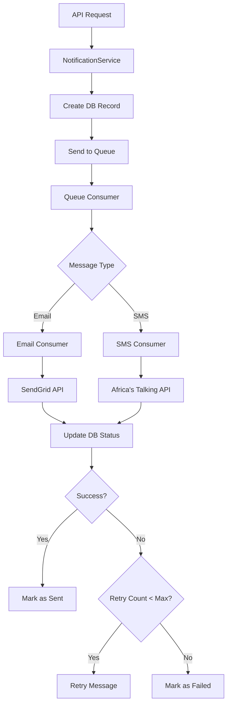

# Task 10.1 Implementation: Notification Service with Queue Integration

## Overview

This document describes the implementation of Task 10.1: Create notification service with queue integration. The implementation enhances the existing notification infrastructure with improved queue handling, batch processing, and comprehensive notification templates.

## Implementation Details

### 1. Enhanced Notification Service (`services/notificationService.ts`)

**Key Features:**
- Comprehensive email and SMS templates for all request status changes
- Support for QueueService integration
- Specialized notification methods for different scenarios
- Rich HTML email templates with proper styling

**New Methods:**
- `sendRequestStatusNotification()` - Handles all request status change notifications
- `sendPaymentConfirmationNotification()` - Sends payment confirmation with M-Pesa receipt
- `sendAdminNewRequestNotification()` - Notifies admins of new requests
- `sendAdminVerificationNotification()` - Notifies auditors of requests needing verification
- `sendCommentNotification()` - Notifies relevant parties of new comments

**Template System:**
- Dynamic email templates based on request status
- Contextual SMS messages for important status changes
- Professional HTML formatting with proper styling
- Personalized content with user names and request details

### 2. Enhanced Queue Consumers

#### Email Queue Consumer (`queues/emailQueue.ts`)
**Improvements:**
- Batch processing for better performance
- Enhanced error handling with detailed logging
- Proper retry logic with configurable limits
- SendGrid API integration with comprehensive error handling
- Database status tracking for all notification attempts

#### SMS Queue Consumer (`queues/smsQueue.ts`)
**Improvements:**
- Batch processing optimized for SMS delivery
- Africa's Talking API integration with status validation
- Enhanced retry logic with proper error categorization
- Delivery confirmation tracking
- Comprehensive logging for debugging

### 3. Queue Service (`services/queueService.ts`)

**New Centralized Queue Management:**
- `QueueService` class for centralized queue operations
- Batch sending capabilities for both email and SMS
- Delayed notification scheduling
- Health check functionality for queue monitoring
- Proper error handling and logging

**Key Methods:**
- `sendEmailToQueue()` - Send individual email to queue
- `sendSMSToQueue()` - Send individual SMS to queue
- `sendEmailBatchToQueue()` - Send batch of emails
- `sendSMSBatchToQueue()` - Send batch of SMS messages
- `sendDelayedEmailNotification()` - Schedule delayed emails
- `sendDelayedSMSNotification()` - Schedule delayed SMS
- `healthCheck()` - Monitor queue health

### 4. Notification Management API (`handlers/notifications.ts`)

**New API Endpoints:**
- `GET /api/v1/notifications` - List user notifications with pagination
- `GET /api/v1/notifications/unread-count` - Get count of unread notifications
- `GET /api/v1/notifications/:id` - Get specific notification details
- `GET /api/v1/notifications/stats` - Get notification statistics

**Features:**
- Proper pagination support
- User-specific notification filtering
- Comprehensive notification statistics
- Secure access control (users can only see their own notifications)

### 5. Enhanced Queue Routing (`api/index.ts`)

**Improvements:**
- Intelligent queue message routing based on message structure
- Better error handling for unknown message formats
- Comprehensive logging for debugging
- Proper message acknowledgment handling

## Configuration

### Cloudflare Queues Setup (wrangler.toml)

```toml
# Email Queue
[[queues.producers]]
binding = "EMAIL_QUEUE"
queue = "email-notifications"

[[queues.consumers]]
queue = "email-notifications"
max_batch_size = 10
max_batch_timeout = 30
max_retries = 3
dead_letter_queue = "email-notifications-dlq"

# SMS Queue
[[queues.producers]]
binding = "SMS_QUEUE"
queue = "sms-notifications"

[[queues.consumers]]
queue = "sms-notifications"
max_batch_size = 10
max_batch_timeout = 30
max_retries = 3
dead_letter_queue = "sms-notifications-dlq"
```

### Required Environment Variables

```bash
# Email Service (SendGrid)
SENDGRID_API_KEY=your_sendgrid_api_key

# SMS Service (Africa's Talking)
AT_API_KEY=your_africas_talking_api_key
AT_USERNAME=your_africas_talking_username
```

## Notification Templates

### Email Templates

The system includes comprehensive email templates for:

1. **Request Status Changes:**
   - Request Submitted
   - Under Review
   - Approved
   - Verified
   - Payment Completed
   - Rejected
   - Flagged
   - Additional Documents Required
   - Archived

2. **User Account Management:**
   - Registration Confirmation
   - Account Approved
   - Account Rejected
   - Account Deactivated
   - Account Reactivated

3. **Admin Notifications:**
   - New Request Submitted
   - Request Requires Verification
   - Comment Added

### SMS Templates

SMS notifications are sent for critical status changes:
- Request Approved
- Payment Completed
- Request Rejected
- Additional Documents Required

## Queue Processing Flow



## Error Handling

### Retry Logic
- Maximum 3 retries per notification
- Exponential backoff handled by Cloudflare Queues
- Failed messages moved to dead letter queue after max retries
- Comprehensive error logging for debugging

### Database Tracking
- All notification attempts tracked in database
- Status updates: pending → sent/failed
- Retry count tracking
- Failure reason logging
- Metadata storage for API responses

## Testing

### Manual Testing

1. **Email Notifications:**
```bash
# Test user registration notification
curl -X POST http://localhost:8787/api/v1/auth/register \
  -H "Content-Type: application/json" \
  -d '{
    "email": "test@example.com",
    "phone": "+254712345678",
    "password": "TestPass123!",
    "firstName": "Test",
    "lastName": "User",
    "role": "STUDENT"
  }'
```

2. **Request Status Notifications:**
```bash
# Submit a request (triggers notifications)
curl -X POST http://localhost:8787/api/v1/requests \
  -H "Authorization: Bearer YOUR_JWT_TOKEN" \
  -H "Content-Type: application/json" \
  -d '{
    "type": "SCHOOL_FEES",
    "amount": 15000,
    "reason": "Tuition payment for Term 2"
  }'
```

3. **Check Notification Status:**
```bash
# Get user notifications
curl -X GET http://localhost:8787/api/v1/notifications \
  -H "Authorization: Bearer YOUR_JWT_TOKEN"

# Get unread count
curl -X GET http://localhost:8787/api/v1/notifications/unread-count \
  -H "Authorization: Bearer YOUR_JWT_TOKEN"
```

### Queue Health Check

```bash
# The QueueService includes a health check method
# This can be called programmatically to verify queue connectivity
```

## Performance Optimizations

1. **Batch Processing:**
   - Email queue processes up to 5 messages per batch
   - SMS queue processes up to 10 messages per batch
   - Reduces API calls and improves throughput

2. **Database Efficiency:**
   - Bulk status updates where possible
   - Indexed queries for notification retrieval
   - Pagination to handle large notification lists

3. **Error Recovery:**
   - Graceful handling of partial batch failures
   - Individual message retry logic
   - Dead letter queue for permanent failures

## Security Considerations

1. **Access Control:**
   - Users can only access their own notifications
   - Admin notifications properly scoped
   - JWT authentication required for all endpoints

2. **Data Protection:**
   - Sensitive information excluded from logs
   - API keys stored as environment variables
   - Notification content sanitized

3. **Rate Limiting:**
   - Queue batch sizes prevent API overload
   - Retry limits prevent infinite loops
   - Proper timeout handling

## Monitoring and Logging

1. **Queue Monitoring:**
   - Batch processing logs
   - Success/failure rate tracking
   - Dead letter queue monitoring

2. **API Monitoring:**
   - SendGrid API response tracking
   - Africa's Talking API status monitoring
   - Database operation logging

3. **Performance Metrics:**
   - Notification delivery times
   - Queue processing throughput
   - Error rate analysis

## Future Enhancements

1. **Advanced Features:**
   - Notification preferences per user
   - Template customization
   - Delivery scheduling
   - Push notifications

2. **Analytics:**
   - Delivery rate analytics
   - User engagement metrics
   - Template performance analysis

3. **Integration:**
   - Additional SMS providers
   - Email template builder
   - Webhook notifications for external systems

## Conclusion

The enhanced notification service provides a robust, scalable solution for handling email and SMS notifications in the Financial Transparency System. The implementation includes:

- ✅ Cloudflare Queue integration for reliable message processing
- ✅ Comprehensive notification templates for all scenarios
- ✅ Batch processing for improved performance
- ✅ Robust error handling and retry logic
- ✅ User-friendly notification management API
- ✅ Proper security and access control
- ✅ Comprehensive logging and monitoring

The system is ready for production use and can handle the notification requirements specified in Requirements 9.1, 9.2, and 9.3.